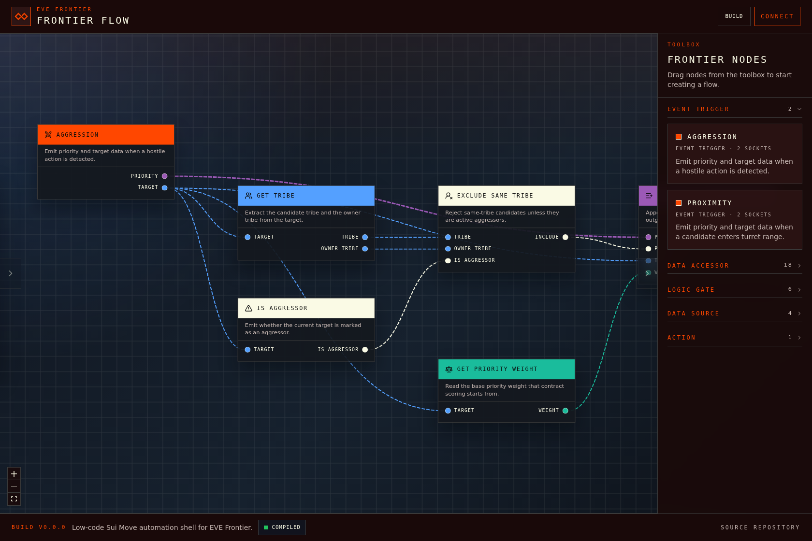

# Frontier Flow

### From idea to deployment in under 10 minutes for EVE Frontier automation builders

[](https://github.com/Scetrov/frontier-flow/graphs/contributors)
[](https://github.com/Scetrov/frontier-flow/network/members)
[](https://github.com/Scetrov/frontier-flow/stargazers)
[](https://github.com/Scetrov/frontier-flow/issues)
[](https://github.com/Scetrov/frontier-flow/blob/main/LICENSE.md)

Frontier Flow is a low-code visual editor for EVE Frontier players who want to design game automation logic without hand-writing smart contract code. Build automation flows on a node canvas, generate deterministic Sui Move output in the browser, validate logic before deployment, and move from concept to contract fast.

For contributors, the repository is set up for fast local iteration with Bun, strict TypeScript, a clear verification pipeline, and project documentation that explains the product, architecture, design system, and contribution workflow.

## Table of Contents

- [About The Project](#about-the-project)
- [Features](#features)
- [Built With](#built-with)
- [Getting Started](#getting-started)
- [Usage](#usage)
- [Roadmap](#roadmap)
- [Contributing](#contributing)
- [License](#license)
- [Contact](#contact)
- [Acknowledgments](#acknowledgments)

## About The Project

Frontier Flow is designed for players who think visually, iterate quickly, and still need production-ready output. Instead of hand-coding every rule, you build your automation logic by connecting typed nodes that represent events, filters, data accessors, scoring rules, and actions.

The editor is tuned for the EVE Frontier domain and backed by a TypeScript-first frontend, a browser-based compilation pipeline, and deterministic code generation. That means you can:

- sketch contract logic as a flowchart
- validate your graph before wasting time on broken builds
- inspect compile feedback directly in the UI
- generate readable, predictable Move code ready for the next deployment step



_The main editor view with the starter contract loaded, typed nodes visible on the canvas, toolbox categories on the right, and compilation status in the footer._

## Features

- ⚡ Build automation flows visually with a drag-and-drop node editor
- 🧠 Translate EVE Frontier logic into deterministic Sui Move code
- 🛡️ Catch disconnected nodes, missing inputs, and invalid graphs early
- 🔁 Auto-compile on idle with manual build control when you want it
- 🎯 Surface compiler diagnostics back onto the exact canvas nodes involved
- 🚀 Move from idea to deployment-ready output in under 10 minutes
- 🧪 Validate behavior with unit, component, and end-to-end tests

## Built With


Major project foundations include:

- Bun
- TypeScript
- React 19
- Vite
- Tailwind CSS 4
- React Flow via `@xyflow/react`
- `@zktx.io/sui-move-builder` for in-browser Move compilation

## Getting Started

> 👋 Contributor quick start: if you want to work on the codebase, the shortest path is `bun install`, `bun run dev`, then `bun run verify` before you open a pull request.

### Prerequisites

Make sure the following tools are available locally:

- Bun `>= 1.0.0`
- TypeScript `5.9+`
- Git

You can verify your environment with:

```bash
bun --version
tsc --version
git --version
```

### Installation

1. Clone the repository.
2. Install dependencies.
3. Start the development server.

```bash
git clone https://github.com/Scetrov/frontier-flow.git
cd frontier-flow
bun install
bun run dev
```

For a local quality gate before opening a PR:

```bash
bun run verify
```

## Usage

### Start the app locally

```bash
bun run dev
```

Open the local URL printed by Vite, then:

1. Drag a trigger node such as `Aggression` or `Proximity` onto the canvas.
2. Add filters, accessors, and queue actions.
3. Wait for auto-compile or click `Build`.
4. Review compile status and diagnostics in the footer.
5. Iterate until the graph is valid and deployment-ready.

### Run tests

```bash
bun run test
```

Run the CI-style test suite once:

```bash
bun run test:run
```

Run end-to-end tests:

```bash
bun run test:e2e
```

Run the opt-in real WASM compiler integration check:

```bash
bun run test:real-wasm
```

This executes a Bun-based integration script that feeds reference graph fixtures directly into the compiler pipeline and asserts that valid bytecode is produced.

### Build for production

```bash
bun run build
```

### Typical contributor workflow

```bash
# install dependencies
bun install

# start the local app
bun run dev

# run static checks and tests
bun run lint
bun run typecheck
bun run test:run
```

## Roadmap

- 🧩 Expanded node packs for more EVE Frontier mechanics and strategies
- 📦 Shareable contract templates and starter flow presets
- 🔐 Wallet-driven deployment workflow directly from the editor
- 👥 Collaboration-friendly features for team iteration and review
- 📊 Richer compile insights, graph analytics, and optimization hints
- 🌐 Better onboarding, documentation, and example contract libraries

See the [open issues](https://github.com/Scetrov/frontier-flow/issues) for active work and proposed improvements.

## Contributing

Contributions are welcome from developers, UI engineers, tool builders, and EVE Frontier players with strong workflow ideas.

To contribute:

1. Fork the repository.
2. Create a feature branch.
3. Make your changes.
4. Run the local checks.
5. Commit with a clear message.
6. Push your branch.
7. Open a pull request.

```bash
git checkout -b feat/your-improvement
bun run verify
git commit -m "feat: describe your change"
git push origin feat/your-improvement
```

Before contributing, please review:

- [CONTRIBUTING.md](./CONTRIBUTING.md)
- [CODE_OF_CONDUCT.md](./CODE_OF_CONDUCT.md)

## License

Distributed under the MIT License. See [LICENSE.md](./LICENSE.md) for the full text.

## Contact


- Website: [scetrov.live](https://scetrov.live)
- GitHub: [github.com/Scetrov](https://github.com/Scetrov)
- Project: [github.com/Scetrov/frontier-flow](https://github.com/Scetrov/frontier-flow)

## Acknowledgments

- CCP Games and the EVE Frontier universe for the domain inspiration
- The React and TypeScript ecosystems for a solid frontend foundation
- The `@xyflow/react` maintainers for the node-based editing engine
- The Sui and Move tooling ecosystem for contract compilation workflows
- Bun, Vite, Playwright, and Vitest for keeping local iteration fast

If Frontier Flow helps your workflow, star the repository and share your feedback.