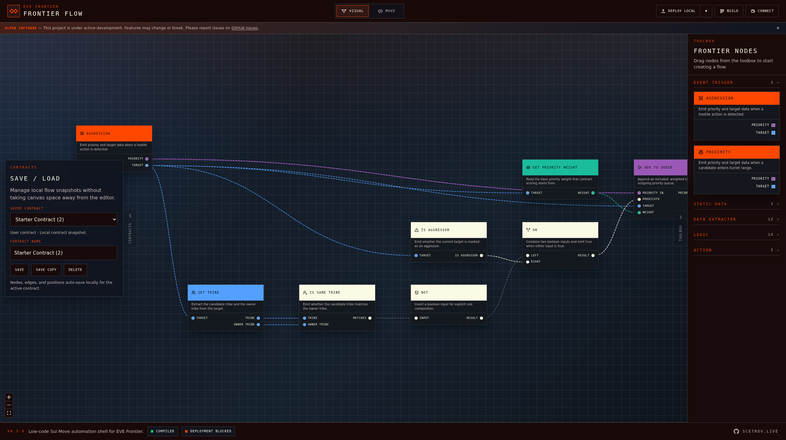
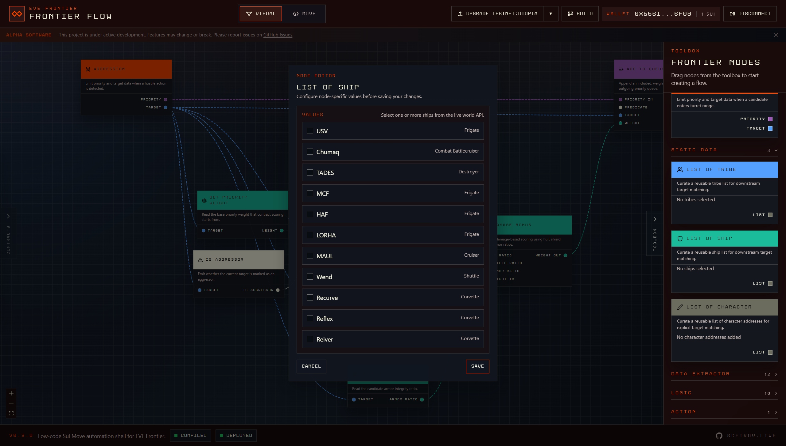
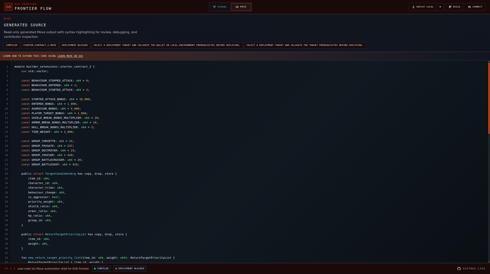
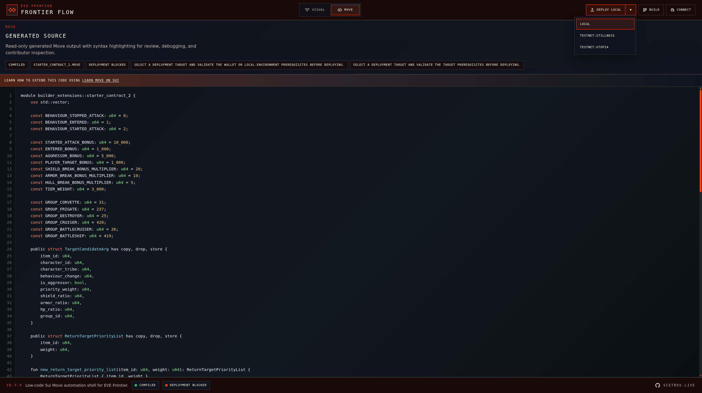
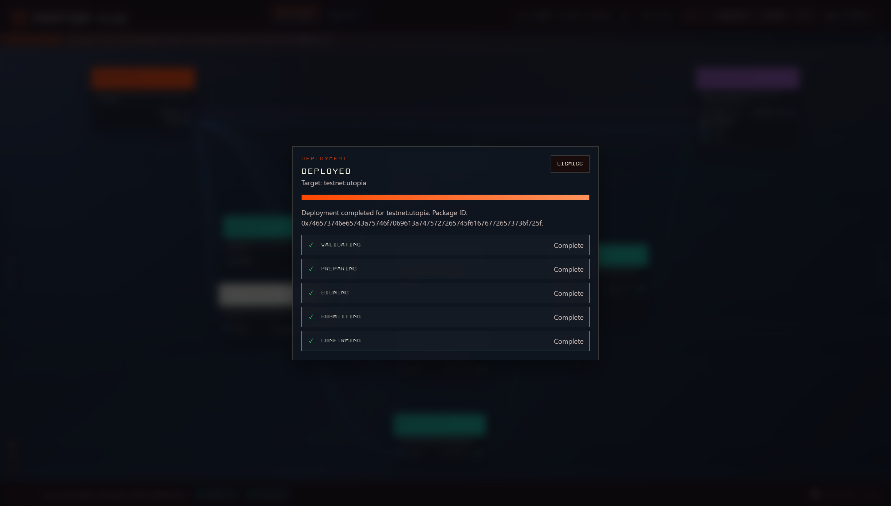

# Frontier Flow

## From idea to deployment in under 10 minutes for EVE Frontier automation builders

[](https://github.com/Scetrov/frontier-flow/graphs/contributors)
[](https://github.com/Scetrov/frontier-flow/network/members)
[](https://github.com/Scetrov/frontier-flow/stargazers)
[](https://github.com/Scetrov/frontier-flow/issues)
[](https://github.com/Scetrov/frontier-flow/blob/main/LICENSE.md)

Frontier Flow is a low-code visual editor for EVE Frontier players who want to design game automation logic without hand-writing smart contract code. Build automation flows on a node canvas, generate deterministic Sui Move output in the browser, validate logic before deployment, and move from concept to contract fast.

For contributors, the repository is set up for fast local iteration with Bun, strict TypeScript, a clear verification pipeline, and project documentation that explains the product, architecture, design system, and contribution workflow.

## Table of Contents

- [About The Project](#about-the-project)
- [Features](#features)
- [Built With](#built-with)
- [Getting Started](#getting-started)
- [Usage](#usage)
- [Workflow Screenshots](#workflow-screenshots)
- [Roadmap](#roadmap)
- [Contributing](#contributing)
- [License](#license)
- [Contact](#contact)
- [Acknowledgments](#acknowledgments)

## About The Project

Frontier Flow is designed for players who think visually, iterate quickly, and still need production-ready output. Instead of hand-coding every rule, you build your automation logic by connecting typed nodes that represent events, filters, data accessors, scoring rules, and actions.

The editor is tuned for the EVE Frontier domain and backed by a TypeScript-first frontend, a browser-based compilation pipeline, and deterministic code generation. That means you can:

- sketch contract logic as a flowchart
- validate your graph before wasting time on broken builds
- inspect compile feedback directly in the UI
- generate readable, predictable Move code ready for the next deployment step



_The Visual view with a saved contract open, typed connections on the canvas, node categories in the toolbox, and build status in the footer._

## Features

- ⚡ Build automation flows visually with a drag-and-drop node editor
- 🧠 Translate EVE Frontier logic into deterministic Sui Move code
- 🛡️ Catch disconnected nodes, missing inputs, and invalid graphs early
- 🔁 Auto-compile on idle with manual build control when you want it
- 🎯 Surface compiler diagnostics back onto the exact canvas nodes involved
- 🚀 Move from idea to deployment-ready output in under 10 minutes
- 🧪 Validate behavior with unit, component, and end-to-end tests

## Built With


Major project foundations include:

- Bun
- TypeScript
- React 19
- Vite
- Tailwind CSS 4
- React Flow via `@xyflow/react`
- `@zktx.io/sui-move-builder` for in-browser Move compilation

## Getting Started

> 👋 Contributor quick start: if you want to work on the codebase, the shortest path is `bun install`, `bun run dev`, then `bun run verify` before you open a pull request.

### Prerequisites

Make sure the following tools are available locally:

- Bun `>= 1.0.0`
- TypeScript `5.9+`
- Git

You can verify your environment with:

```bash
bun --version
tsc --version
git --version
```

### Installation

1. Clone the repository.
2. Install dependencies.
3. Start the development server.

```bash
git clone https://github.com/Scetrov/frontier-flow.git
cd frontier-flow
bun install
bun run dev
```

For a local quality gate before opening a PR:

```bash
bun run verify
```

## Usage

### Start the app locally

```bash
bun run dev
```

Open http://localhost:5179 or the local URL printed by Vite, then:

1. Stay in the `Visual` view and drag a trigger node such as `Aggression` or `Proximity` onto the canvas.
2. Add logic, data, and action nodes, then connect their typed sockets.
3. Configure any node that needs structured values.
4. Wait for auto-compile or click `Build`.
5. Switch to the `Move` view to inspect the generated source and deployment readiness.

### Run tests

```bash
bun run test
```

Run the CI-style test suite once:

```bash
bun run test:run
```

Run end-to-end tests:

```bash
bun run test:e2e
```

Run the opt-in real WASM compiler integration check:

```bash
bun run test:real-wasm
```

This executes a Bun-based integration script that feeds reference graph fixtures directly into the compiler pipeline and asserts that valid bytecode is produced.

Run the focused reference-regression and authorization-readiness checks:

```bash
bun run test:run -- src/__tests__/compiler/referenceDagValidation.test.ts
bun run test:e2e -- generated-contracts.spec.ts authorization-readiness.spec.ts
```

### Build for production

```bash
bun run build
```

### Typical contributor workflow

```bash
# install dependencies
bun install

# start the local app
bun run dev

# run static checks and tests
bun run lint
bun run typecheck
bun run test:run
```

## Workflow Screenshots

The current UI follows a five-stage workflow: compose the graph in `Visual`, configure node data, review generated output in `Move`, deploy to the selected target, and confirm the published package metadata.

### 1. Compose the contract graph


Start in the `Visual` view by dragging Frontier nodes from the toolbox onto the canvas, wiring typed sockets, and saving the flow as a named contract snapshot. This is the main authoring stage, where triggers, logic, data extractors, and actions are combined into a deterministic graph.

### 2. Configure node-specific data



Open the node editor when a graph element needs structured input. In this example, the `List of Ship` node lets you select one or more live-world ship entries that feed downstream target matching and priority logic.

### 3. Inspect generated Move output



Switch to the `Move` view to inspect the generated source before deployment. The top bar keeps `Build` and deploy-target controls available while the source panel shows the exact Move module produced from the graph, along with status badges for build output and deployment readiness.

### 4. Track deployment progress



When you deploy, Frontier Flow surfaces each stage of the pipeline in a modal: validation, preparation, signing, submission, and confirmation. Instead of a single opaque loading state, the UI shows which step is active and which steps have already completed.

### 5. Confirm the deployed package



After the transaction finalizes, the modal switches to a completed state and shows the target environment plus the published package ID. This is the handoff point for follow-up testing, upgrades, or any workflow that needs confirmed deployment metadata.

## Roadmap

- 🧩 Expanded node packs for more EVE Frontier mechanics and strategies
- 📦 Shareable contract templates and starter flow presets
- 🔐 Wallet-driven deployment workflow directly from the editor
- 👥 Collaboration-friendly features for team iteration and review
- 📊 Richer compile insights, graph analytics, and optimization hints
- 🌐 Better onboarding, documentation, and example contract libraries

See the [open issues](https://github.com/Scetrov/frontier-flow/issues) for active work and proposed improvements.

## Contributing

Contributions are welcome from developers, UI engineers, tool builders, and EVE Frontier players with strong workflow ideas.

To contribute:

1. Fork the repository.
2. Create a feature branch.
3. Make your changes.
4. Run the local checks.
5. Commit with a clear message.
6. Push your branch.
7. Open a pull request.

```bash
git checkout -b feat/your-improvement
bun run verify
git commit -m "feat: describe your change"
git push origin feat/your-improvement
```

Before contributing, please review:

- [CONTRIBUTING.md](./CONTRIBUTING.md)
- [CODE_OF_CONDUCT.md](./CODE_OF_CONDUCT.md)

## License

Distributed under the MIT License. See [LICENSE.md](./LICENSE.md) for the full text.

## Contact


- Website: [scetrov.live](https://scetrov.live)
- GitHub: [github.com/Scetrov](https://github.com/Scetrov)
- Project: [github.com/Scetrov/frontier-flow](https://github.com/Scetrov/frontier-flow)

## Acknowledgments

- CCP Games and the EVE Frontier universe for the domain inspiration
- The React and TypeScript ecosystems for a solid frontend foundation
- The `@xyflow/react` maintainers for the node-based editing engine
- The Sui and Move tooling ecosystem for contract compilation workflows
- Bun, Vite, Playwright, and Vitest for keeping local iteration fast

If Frontier Flow helps your workflow, star the repository and share your feedback.
