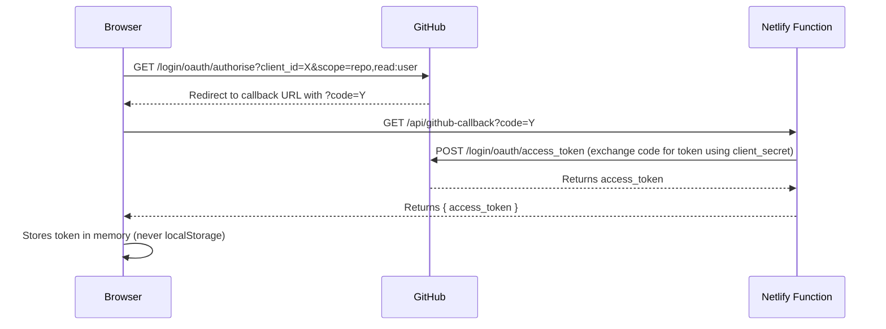

## Table of Contents

1. [Graph Data Model](#1-graph-data-model)
2. [Intermediate Representation (IR)](#2-intermediate-representation-ir)
3. [Code Generator Contracts](#3-code-generator-contracts)
4. [Persistence Formats](#4-persistence-formats)
5. [External API Interfaces](#5-external-api-interfaces)
6. [Artifact Lifecycle Metadata](#6-artifact-lifecycle-metadata)

---

## 1. Graph Data Model

### 1.1 Node Data Interface

All custom nodes receive their data through React Flow's `NodeProps<T>`. The `data` payload conforms to:

```typescript
interface FlowNodeData {
  /** Additional runtime metadata carried on the React Flow node payload */
  [key: string]: unknown;
  /** Node type identifier used by the compiler pipeline */
  type: string;
  /** Display label shown in the node header */
  label: string;
  /** Short description displayed in the node body */
  description: string;
  /** Accent colour token used for the node header */
  color: string;
  /** High-level toolbox grouping */
  category: NodeCategory;
  /** Typed sockets rendered on the node */
  sockets: readonly SocketDefinition[];
  /** Persisted per-instance configuration */
  fields: NodeFieldMap;
  /** Optional lifecycle metadata for deprecated or retired nodes */
  deprecation?: NodeDeprecation;
  /** Restore-time notice for legacy content that needs user follow-up */
  remediationNotice?: RemediationNotice;
  /** Current validation or restore messages shown inline on the node */
  diagnosticMessages?: readonly string[];
  /** Highest severity represented in diagnosticMessages */
  validationState?: "warning" | "error";
}

type NodeFieldScalar = string | number | boolean;

type NodeFieldValue = NodeFieldScalar | readonly string[] | readonly number[] | readonly boolean[];

type NodeFieldMap = Readonly<Record<string, NodeFieldValue>>;

interface NodeDeprecation {
  status: "deprecated" | "retired";
  reason: string;
  replacedBy?: readonly string[];
  remediationMessage?: string;
}

interface RemediationNotice {
  nodeId: string;
  legacyType: string;
  message: string;
  severity: "warning" | "error";
  suggestedAction: string;
}
```

### 1.2 Node Shape (React Flow)

```typescript
import type { Node } from "@xyflow/react";

type FlowNode = Node<FlowNodeData, NodeType>;

type NodeType = string;
```

### 1.3 Edge Shape (React Flow)

```typescript
import type { Edge, MarkerType } from "@xyflow/react";

interface FlowEdge extends Edge {
  sourceHandle: string; // Socket ID on source node (e.g., "target", "tribe")
  targetHandle: string; // Socket ID on target node
  animated: boolean; // Always true for data-flow edges
  style: {
    stroke: string; // CSS variable mapping to socket colour
    strokeWidth: number; // 2px standard, 3px for Vector types
  };
  markerEnd: {
    type: MarkerType.ArrowClosed;
    color: string; // Matches stroke colour
  };
}
```

### 1.4 Socket Definition

```typescript
interface SocketDefinition {
  id: string; // Unique handle ID within the node
  type: SocketType; // Data type for compatibility
  position: "left" | "right" | "top" | "bottom"; // Handle placement
  direction: "input" | "output"; // Data flow direction
  label: string; // Display label next to socket
}

type SocketType =
  | "rider"
  | "tribe"
  | "standing"
  | "wallet"
  | "priority"
  | "target"
  | "boolean"
  | "number"
  | "string"
  | "any";
```

### 1.5 Socket Compatibility Matrix

See [SOLUTION-DESIGN.md §2.1](./SOLUTION-DESIGN.md#21-socket-connection-rules) for the full runtime compatibility map.

```typescript
const socketCompatibility: Record<SocketType, SocketType[]= {
  rider: ["rider", "any"],
  tribe: ["tribe", "any"],
  standing: ["standing", "number", "any"],
  wallet: ["wallet", "any"],
  priority: ["priority", "any"],
  target: ["target", "rider", "any"],
  boolean: ["boolean", "any"],
  number: ["number", "standing", "any"],
  string: ["string", "any"],
  any: [
    "rider",
    "tribe",
    "standing",
    "wallet",
    "priority",
    "target",
    "boolean",
    "number",
    "string",
    "any",
  ],
};
```

---

## 2. Intermediate Representation (IR)

The IR is the bridge between the visual graph and the Move code emitter. It is produced by Phase 1 and consumed by Phases 2–4.

### 2.1 IR Node

```typescript
interface IRNode {
  /** React Flow node ID (e.g., "dnd_3_1708642800000") */
  id: string;
  /** Resolved node type from the type registry */
  type: NodeType;
  /** Sanitised label (post Phase 3 validation) */
  label: string;
  /** User-editable field values */
  fields: Record<string, string | number | boolean>;
  /** Inbound connections keyed by target socket ID */
  inputs: Record<string, IRConnection>;
  /** Outbound connections keyed by source socket ID */
  outputs: Record<string, IRConnection[]>;
  /** Gas cost annotation (populated in Phase 3.5) */
  estimatedGas?: number;
  /** Whether this node was pruned by the optimiser */
  pruned?: boolean;
}
```

### 2.2 IR Connection

```typescript
interface IRConnection {
  /** Source node ID */
  sourceNodeId: string;
  /** Source socket ID */
  sourceSocketId: string;
  /** Target node ID */
  targetNodeId: string;
  /** Target socket ID */
  targetSocketId: string;
  /** Resolved socket type for edge colouring */
  socketType: SocketType;
}
```

### 2.3 IR Graph

```typescript
interface IRGraph {
  /** All nodes indexed by ID */
  nodes: Map<string, IRNode>;
  /** All connections */
  connections: IRConnection[];
  /** Topologically sorted node execution order */
  executionOrder: string[];
  /** Module name for the generated Move package */
  moduleName: string;
  /** User-requested module name before sanitisation */
  requestedModuleName: string;
  /** Graph node ids excluded from any event-trigger execution path */
  disconnectedNodeIds: readonly string[];
  /** Graph node ids that could not be ordered because of dependency issues */
  unresolvedNodeIds: readonly string[];
}
```

### 2.4 Optimisation Report

Produced by Phase 3.5 (AST Pruning & Gas Optimisation):

```typescript
interface OptimizationReport {
  /** Total IR nodes before optimization */
  originalNodeCount: number;
  /** Total IR nodes after optimization */
  optimizedNodeCount: number;
  /** Nodes removed by Dead Branch Elimination */
  nodesRemoved: string[];
  /** Nodes rewritten by optimization passes */
  nodesRewritten: Array<{
    nodeId: string;
    pass: "dead-branch" | "vector-folding" | "constant-propagation";
    description: string;
  }>;
  /** Total estimated gas before optimization */
  gasBefore: number;
  /** Total estimated gas after optimization */
  gasAfter: number;
  /** Per-pass summary */
  passResults: Array<{
    passName: string;
    nodesRemoved: number;
    nodesRewritten: number;
  }>;
}
```

### 2.5 Generated Contract Artifact

```typescript
interface ContractIdentity {
  packageName: string;
  moduleName: string;
  requestedModuleName: string;
}

interface GeneratedSourceFile {
  path: string;
  content: string;
}

interface ArtifactManifest {
  moveToml: string;
  dependencies: readonly string[];
}

interface ContractSectionTrace {
  id: string;
  label: string;
  nodeIds: readonly string[];
  lineStart: number;
  lineEnd: number;
}

interface CompileReadiness {
  ready: boolean;
  blockedReasons: readonly string[];
  nextActionSummary: string;
}

type DeploymentStatusType = "blocked" | "ready" | "deployed";

interface DeploymentStatus {
  artifactId: string;
  status: DeploymentStatusType;
  targetMode: "existing-turret";
  requiredInputs: readonly string[];
  resolvedInputs: readonly string[];
  blockedReasons: readonly string[];
  nextActionSummary: string;
}

interface GeneratedContractArtifact {
  artifactId?: string;
  sourceDagId?: string;
  contractIdentity?: ContractIdentity;
  sourceFiles?: readonly GeneratedSourceFile[];
  manifest?: ArtifactManifest;
  traceSections?: readonly ContractSectionTrace[];
  diagnostics?: readonly CompilerDiagnostic[];
  compileReadiness?: CompileReadiness;
  deploymentStatus?: DeploymentStatus;
  moduleName: string;
  sourceFilePath: string;
  moveToml: string;
  moveSource: string;
  sourceMap: readonly SourceMapEntry[];
  dependencies: readonly string[];
  bytecodeModules: readonly Uint8Array[];
}
```

---

## 3. Code Generator Contracts

### 3.1 Generator Interface

Each node type implements a code generation strategy:

```typescript
interface NodeCodeGenerator {
  /** Node type this generator handles */
  readonly nodeType: NodeType;

  /**
   * Validates if this node has its minimum required inputs connected.
   * @param node - The IR node to validate
   * @returns Validation result with any error messages
   */
  validate(node: IRNode): ValidationResult;

  /**
   * Emit Move source code for this node.
   * @param node - The IR node to generate code for
   * @param context - Shared generation context (imports, bindings, etc.)
   * @returns Array of annotated source lines
   */
  emit(node: IRNode, context: GenerationContext): AnnotatedLine[];
}
```

### 3.2 Generation Context

Shared mutable context passed through all generators during Phase 4:

```typescript
interface GenerationContext {
  /** Accumulated `use` import statements */
  imports: Set<string>;
  /** Variable bindings: binding name → originating node ID */
  bindings: Map<string, string>;
  /** Struct definitions to emit at module scope */
  structs: string[];
  /** Entry function signatures to emit */
  entryFunctions: string[];
  /** Active module name */
  moduleName: string;
  /** Source map: output line number → originating node ID */
  sourceMap: Map<number, string>;
}
```

### 3.3 Annotated Source Line

```typescript
interface AnnotatedLine {
  /** The Move source code text */
  code: string;
  /** Originating IR node ID for error traceability */
  nodeId: string;
  /** Indentation level (number of 4-space indents) */
  indent: number;
}
```

### 3.4 Compiler Error Mapping

```typescript
interface CompilerErrorMapping {
  /** Raw error line number from the Move compiler */
  compilerLine: number;
  /** Matched IR node ID via source map lookup */
  nodeId: string | null;
  /** Original compiler error message */
  message: string;
  /** Severity: error or warning */
  severity: "error" | "warning";
}
```

### 3.5 Generated Output Example

```move
module builder_extensions::turret_logic {
    use sui::bcs;
    use sui::event;
    use world::turret::{Self, TargetCandidate, ReturnTargetPriorityList, OnlineReceipt, Turret};
    use world::character::{Self, Character};

    public struct TurretAuth has drop {}

    public struct PriorityListUpdatedEvent has copy, drop {
        turret_id: ID,
        priority_list: vector<TargetCandidate>,
    }

    // @ff-node:dnd_1_1708642800000
    /// Extension entry: evaluates target candidates and returns prioritized target list.
    /// Receives BCS-serialized vector<TargetCandidateand returns BCS-serialized vector<ReturnTargetPriorityList>.
    public fun get_target_priority_list(
        turret: &Turret,
        owner_character: &Character,
        target_candidate_list: vector<u8>,
        receipt: OnlineReceipt,
    ): vector<u8{
        assert!(turret::turret_id(&receipt) == object::id(turret), 1); // EInvalidOnlineReceipt

        // @ff-node:dnd_2_1708642800001
        // Deserialize candidates from BCS bytes
        let candidates = turret::unpack_candidate_list(target_candidate_list);
        let mut return_list = vector::empty<ReturnTargetPriorityList>();
        let mut i = 0u64;
        let len = vector::length(&candidates);

        // @ff-node:dnd_3_1708642800002
        // Friend-or-foe check: add if aggressor or different tribe
        while (i < len) {
            let candidate = vector::borrow(&candidates, i);
            let mut weight = turret::candidate_priority_weight(candidate);
            let same_tribe = turret::candidate_character_tribe(candidate) == character::tribe(owner_character);
            let mut excluded = same_tribe && !turret::candidate_is_aggressor(candidate);

            // @ff-node:dnd_4_1708642800003
            // Apply behaviour-based weight adjustments
            if (turret::candidate_behaviour_change(candidate) == turret::behaviour_change_started_attack()) {
                weight = weight + 10000; // STARTED_ATTACK_WEIGHT_INCREMENT
            } else if (turret::candidate_behaviour_change(candidate) == turret::behaviour_change_entered()) {
                if (!same_tribe || turret::candidate_is_aggressor(candidate)) {
                    weight = weight + 1000; // ENTERED_WEIGHT_INCREMENT
                };
            } else if (turret::candidate_behaviour_change(candidate) == turret::behaviour_change_stopped_attack()) {
                excluded = true;
            };

            if (!excluded) {
                let entry = turret::new_return_target_priority_list(
                    turret::candidate_item_id(candidate),
                    weight,
                );
                vector::push_back(&mut return_list, entry);
            };
            i = i + 1;
        };

        // @ff-node:dnd_5_1708642800004
        // Emit event and serialize return list
        event::emit(PriorityListUpdatedEvent {
            turret_id: object::id(turret),
            priority_list: candidates,
        });

        turret::destroy_online_receipt(receipt, TurretAuth {});
        bcs::to_bytes(&return_list)
    }
}
```

Deployment readiness requirement: after publish confirmation, the package must expose `[packageId]::[moduleName]::TurretAuth` via RPC normalization before Frontier Flow persists the deployment snapshot or starts turret authorization. This matches the world-contracts typed-witness flow where `world::turret::authorize_extension<Auth>` stores `type_name::with_defining_ids<Auth>()`, and the extension package is later resolved from that exact witness type.

Remote publish compilation requirement: for published targets, deployment bytecode must be compiled against a generated `deps/world/Published.toml` entry for the selected world package instead of relying on an unpublished local shim plus a manually appended dependency ID. The generated extension package must keep `builder_extensions = "0x0"` for its own address, but it must not redeclare `world = "0x0"` in the root package manifest when compiling the remote publish artifact.

---

## 4. Persistence Formats

### 4.1 Graph Save Format (GitHub Repository)

Saved as `frontier-flow-graph.json`:

```typescript
interface SavedGraph {
  /** Schema version for future migrations */
  version: "1.0.0";
  /** ISO 8601 timestamp */
  savedAt: string;
  /** Active network at time of save */
  network: "localnet" | "devnet" | "testnet" | "mainnet";
  /** React Flow nodes array */
  nodes: FlowNode[];
  /** React Flow edges array */
  edges: FlowEdge[];
  /** Viewport state for restoring camera position */
  viewport: { x: number; y: number; zoom: number };
}
```

### 4.2 UpgradeCap Reference (IndexedDB + GitHub)

Stored in IndexedDB via `idb-keyval` and optionally backed up to GitHub:

```typescript
interface UpgradeCapReference {
  /** Sui object ID of the UpgradeCap */
  objectId: string;
  /** Package ID of the deployed module */
  packageId: string;
  /** Network where the package is deployed */
  network: "localnet" | "devnet" | "testnet" | "mainnet";
  /** Module name for deduplication */
  moduleName: string;
  /** Deployment timestamp */
  deployedAt: string;
  /** Digest of the latest deployed bytecode */
  latestDigest: string;
}
```

### 4.3 Dependency Cache (IndexedDB)

```typescript
interface CachedDependency {
  /** Cache key: `${owner}/${repo}/${path}@${ref}` */
  key: string;
  /** Raw file content */
  content: string;
  /** Cache insertion time (epoch ms) */
  cachedAt: number;
  /** TTL in milliseconds (default: 24 hours) */
  ttl: number;
}
```

---

## 5. External API Interfaces

### 5.1 GitHub API (REST v3)

| Endpoint                                    | Method | Purpose                                               | Auth Required         |
| ------------------------------------------- | ------ | ----------------------------------------------------- | --------------------- |
| `GET /repos/{owner}/{repo}/contents/{path}` | GET    | Fetch Sui Framework source files for WASM compilation | Optional (rate limit) |
| `PUT /repos/{owner}/{repo}/contents/{path}` | PUT    | Save graph JSON / Move code to user repo              | Yes (OAuth)           |
| `GET /user`                                 | GET    | Fetch authenticated user profile                      | Yes (OAuth)           |

### 5.2 GitHub OAuth Flow



### 5.3 Sui JSON-RPC

| Method                        | Purpose                             |
| ----------------------------- | ----------------------------------- |
| `sui_getBalance`              | Display wallet SUI balance          |
| `sui_requestSuiFromFaucet`    | Localnet faucet token request       |
| `sui_dryRunTransactionBlock`  | Pre-flight transaction validation   |
| `sui_executeTransactionBlock` | Publish/upgrade package transaction |

[!NOTE]
All Sui interactions are mediated by `@mysten/sui` SDK and `@mysten/dapp-kit` hooks. Direct JSON-RPC calls are abstracted away.

---

## 6. Artifact Lifecycle Metadata

Compilation and deployment are separate concerns in the current UI and type model.

```typescript
type CompilationStatus =
  | { state: "idle" }
  | { state: "compiling" }
  | { state: "compiled"; bytecode: readonly Uint8Array[]; artifact?: GeneratedContractArtifact }
  | { state: "error"; diagnostics: readonly CompilerDiagnostic[]; artifact?: GeneratedContractArtifact };
```

- `CompilationStatus` describes the active compile attempt.
- `GeneratedContractArtifact.compileReadiness` describes whether the emitted package is ready for compile-adjacent handoff.
- `GeneratedContractArtifact.deploymentStatus` describes downstream deployment state and must not be conflated with compile success in UI surfaces.
