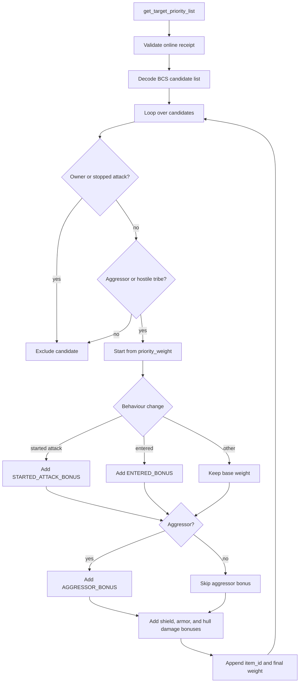
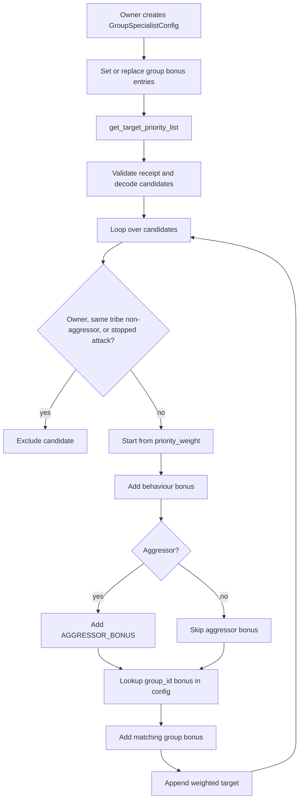
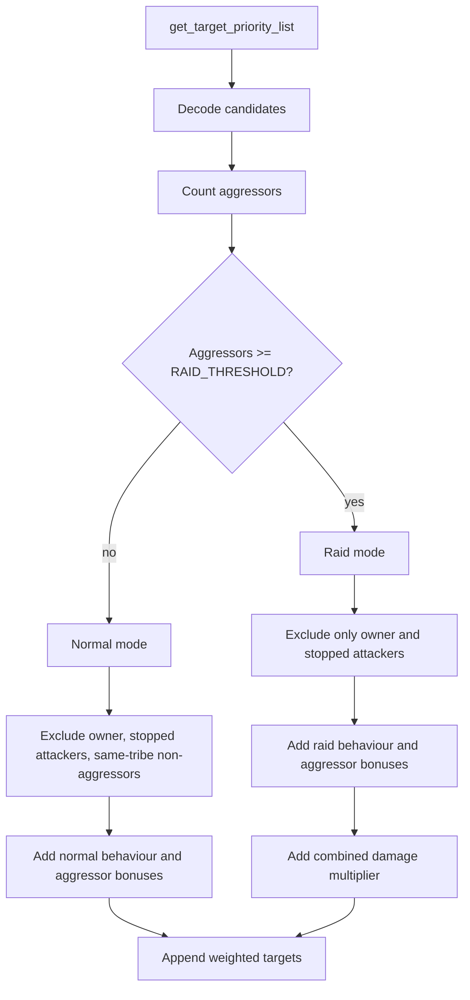
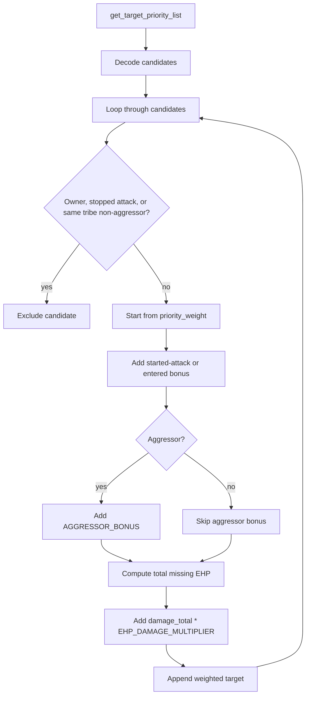
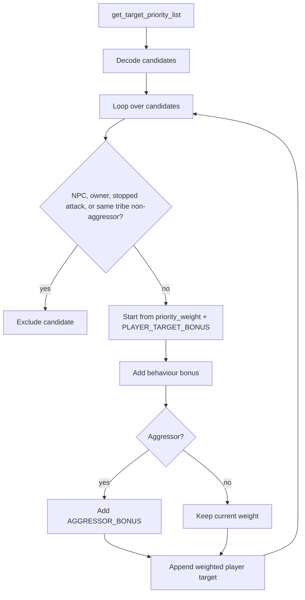
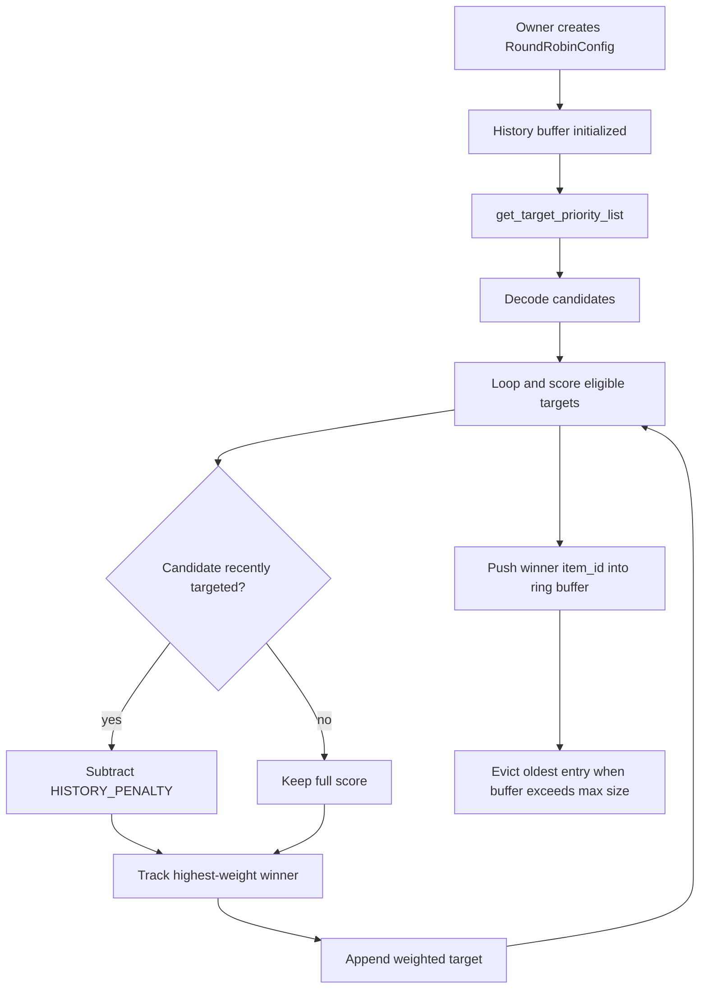
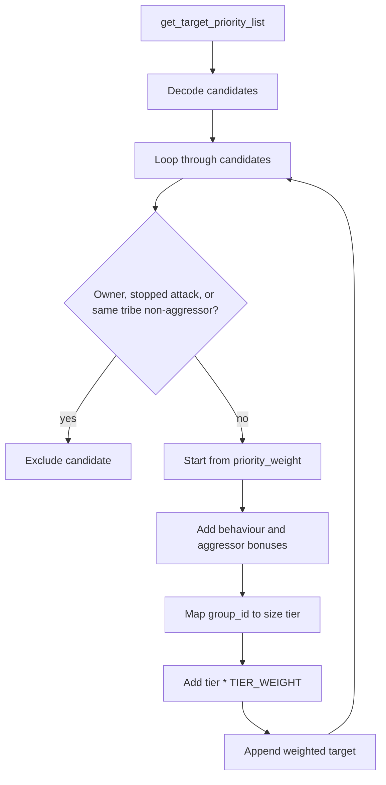
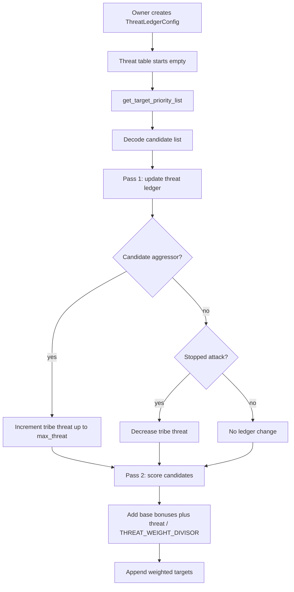
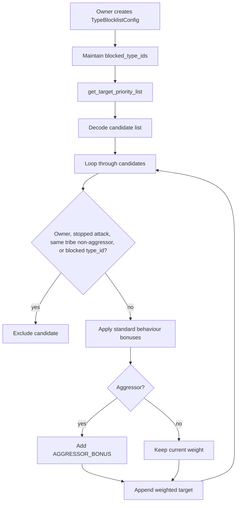

# Examplar Contracts

This section contains exemplar turret strategy Move modules showcasing different approaches to target prioritization. These are intended as templates and inspiration for developers to build their own custom strategies, and can be deployed as-is for basic functionality. Each module implements the `get_target_priority_list` function, which the turret calls to retrieve a weighted list of targets based on the current in-game situation. The strategies demonstrate various ways to interpret the candidate data and apply custom logic for prioritization.

## turret_aggressor_first

```move
/// Standalone turret strategy that aggressively defends the base against current attackers first.
module turret_aggressor_first::aggressor_first;

use sui::bcs;
use world::{
    character::{Self, Character},
    in_game_id,
    turret::{OnlineReceipt, ReturnTargetPriorityList, Turret},
};

use world::turret as world_turret;

const BEHAVIOUR_ENTERED: u8 = 1;
const BEHAVIOUR_STARTED_ATTACK: u8 = 2;
const BEHAVIOUR_STOPPED_ATTACK: u8 = 3;
const STARTED_ATTACK_BONUS: u64 = 20_000;
const AGGRESSOR_BONUS: u64 = 5_000;
const ENTERED_BONUS: u64 = 2_000;
const SHIELD_BREAK_BONUS_MULTIPLIER: u64 = 20;
const ARMOR_BREAK_BONUS_MULTIPLIER: u64 = 10;
const HULL_BREAK_BONUS_MULTIPLIER: u64 = 5;

public struct TargetCandidateArg has copy, drop, store {
    item_id: u64,
    type_id: u64,
    group_id: u64,
    character_id: u32,
    character_tribe: u32,
    hp_ratio: u64,
    shield_ratio: u64,
    armor_ratio: u64,
    is_aggressor: bool,
    priority_weight: u64,
    behaviour_change: u8,
}

public struct TurretAuth has drop {}

public fun get_target_priority_list(
    turret: &Turret,
    owner_character: &Character,
    target_candidate_list: vector<u8>,
    receipt: OnlineReceipt,
): vector<u8> {
    assert!(receipt.turret_id() == object::id(turret), 0);
    let owner_character_id = in_game_id::item_id(&character::key(owner_character)) as u32;
    let return_list = build_priority_list_for_owner(
        owner_character_id,
        character::tribe(owner_character),
        target_candidate_list,
    );
    world_turret::destroy_online_receipt(receipt, TurretAuth {});
    bcs::to_bytes(&return_list)
}

public(package) fun build_priority_list_for_owner(
    owner_character_id: u32,
    owner_tribe: u32,
    target_candidate_list: vector<u8>,
): vector<ReturnTargetPriorityList> {
    let candidates = unpack_candidate_list(target_candidate_list);
    let mut return_list = vector::empty();
    let mut index = 0u64;
    let len = vector::length(&candidates);
    while (index < len) {
        let candidate = vector::borrow(&candidates, index);
        let (weight, include) = score_candidate(owner_character_id, owner_tribe, candidate);
        if (include) {
            vector::push_back(
                &mut return_list,
                world_turret::new_return_target_priority_list(candidate.item_id, weight),
            );
        };
        index = index + 1;
    };
    return_list
}

fun score_candidate(
    owner_character_id: u32,
    owner_tribe: u32,
    candidate: &TargetCandidateArg,
): (u64, bool) {
    let is_owner = candidate.character_id == owner_character_id;
    let same_tribe = candidate.character_tribe == owner_tribe;
    let aggressor = candidate.is_aggressor;
    let reason = candidate.behaviour_change;

    if (is_owner || reason == BEHAVIOUR_STOPPED_ATTACK) {
        return (0, false)
    };
    if (!(aggressor || !same_tribe)) {
        return (0, false)
    };

    let mut weight = candidate.priority_weight;
    if (reason == BEHAVIOUR_STARTED_ATTACK) {
        weight = weight + STARTED_ATTACK_BONUS;
    } else if (reason == BEHAVIOUR_ENTERED) {
        weight = weight + ENTERED_BONUS;
    };
    if (aggressor) {
        weight = weight + AGGRESSOR_BONUS;
    };

    weight = weight + ((100 - candidate.shield_ratio) * SHIELD_BREAK_BONUS_MULTIPLIER);
    weight = weight + ((100 - candidate.armor_ratio) * ARMOR_BREAK_BONUS_MULTIPLIER);
    weight = weight + ((100 - candidate.hp_ratio) * HULL_BREAK_BONUS_MULTIPLIER);
    (weight, true)
}

fun unpack_candidate_list(candidate_list_bytes: vector<u8>): vector<TargetCandidateArg> {
    if (vector::length(&candidate_list_bytes) == 0) {
        return vector::empty()
    };
    let mut bcs_data = bcs::new(candidate_list_bytes);
    bcs_data.peel_vec!(|candidate_bcs| peel_target_candidate_from_bcs(candidate_bcs))
}

fun peel_target_candidate_from_bcs(bcs_data: &mut bcs::BCS): TargetCandidateArg {
    let item_id = bcs_data.peel_u64();
    let type_id = bcs_data.peel_u64();
    let group_id = bcs_data.peel_u64();
    let character_id = bcs_data.peel_u32();
    let character_tribe = bcs_data.peel_u32();
    let hp_ratio = bcs_data.peel_u64();
    let shield_ratio = bcs_data.peel_u64();
    let armor_ratio = bcs_data.peel_u64();
    let is_aggressor = bcs_data.peel_bool();
    let priority_weight = bcs_data.peel_u64();
    let behaviour_change = bcs_data.peel_u8();
    TargetCandidateArg {
        item_id,
        type_id,
        group_id,
        character_id,
        character_tribe,
        hp_ratio,
        shield_ratio,
        armor_ratio,
        is_aggressor,
        priority_weight,
        behaviour_change,
    }
}
```



## turret_group_specialist

```move
/// Turret strategy that lets the owner assign custom weight bonuses per ship `group_id`.
///
/// The owner deploys a shared `GroupSpecialistConfig` object and populates it with
/// `GroupBonus` entries that map a `group_id` to an additional weight bonus.  On each
/// targeting call the turret looks up the candidate's `group_id` in the config and adds
/// the matching bonus before returning the priority list.
///
/// Typical use-case: align the bonus table with the weapon's intended target class.
/// For example an Autocannon turret (specialised against Shuttles group=31 and Corvettes group=237)
/// would give those group_ids a large bonus, while a Howitzer (Cruiser=26 / BattleCruiser=419)
/// would boost those instead.  Standard aggression bonuses still apply on top.
module turret_group_specialist::group_specialist;

use sui::bcs;
use world::{
    access::{Self, OwnerCap},
    character::{Self, Character},
    in_game_id,
    turret::{OnlineReceipt, ReturnTargetPriorityList, Turret},
};

use world::turret as world_turret;

#[error(code = 0)]
const EInvalidOnlineReceipt: vector<u8> = b"Invalid online receipt";
#[error(code = 1)]
const ENotTurretOwner: vector<u8> = b"Caller is not the turret owner";

const BEHAVIOUR_ENTERED: u8 = 1;
const BEHAVIOUR_STARTED_ATTACK: u8 = 2;
const BEHAVIOUR_STOPPED_ATTACK: u8 = 3;
const STARTED_ATTACK_BONUS: u64 = 10_000;
const AGGRESSOR_BONUS: u64 = 5_000;
const ENTERED_BONUS: u64 = 1_000;

/// A group_id -> weight-bonus mapping entry.
public struct GroupBonus has copy, drop, store {
    group_id: u64,
    weight_bonus: u64,
}

/// Shared configuration for the group specialist strategy.
/// Keyed to a specific turret; the owner manages entries via `OwnerCap<Turret>`.
public struct GroupSpecialistConfig has key {
    id: UID,
    /// The Turret object ID this config belongs to.
    turret_id: ID,
    /// List of group_id -> bonus mappings.  Lookup is linear; typically short.
    group_bonuses: vector<GroupBonus>,
}

public struct TurretAuth has drop {}

// ---------------------------------------------------------------------------
// Config management
// ---------------------------------------------------------------------------

public fun create_config(
    turret: &Turret,
    owner_cap: &OwnerCap<Turret>,
    ctx: &mut TxContext,
) {
    assert!(access::is_authorized(owner_cap, object::id(turret)), ENotTurretOwner);
    transfer::share_object(GroupSpecialistConfig {
        id: object::new(ctx),
        turret_id: object::id(turret),
        group_bonuses: vector::empty(),
    });
}

/// Adds or replaces the weight bonus for a given `group_id`.
public fun set_group_bonus(
    config: &mut GroupSpecialistConfig,
    turret: &Turret,
    owner_cap: &OwnerCap<Turret>,
    group_id: u64,
    weight_bonus: u64,
) {
    assert!(access::is_authorized(owner_cap, object::id(turret)), ENotTurretOwner);
    // Remove existing entry for this group_id if present
    let mut i = 0u64;
    while (i < vector::length(&config.group_bonuses)) {
        if (vector::borrow(&config.group_bonuses, i).group_id == group_id) {
            vector::remove(&mut config.group_bonuses, i);
            break
        };
        i = i + 1;
    };
    vector::push_back(&mut config.group_bonuses, GroupBonus { group_id, weight_bonus });
}

/// Removes the weight bonus entry for a `group_id`. No-op if not present.
public fun remove_group_bonus(
    config: &mut GroupSpecialistConfig,
    turret: &Turret,
    owner_cap: &OwnerCap<Turret>,
    group_id: u64,
) {
    assert!(access::is_authorized(owner_cap, object::id(turret)), ENotTurretOwner);
    let mut i = 0u64;
    while (i < vector::length(&config.group_bonuses)) {
        if (vector::borrow(&config.group_bonuses, i).group_id == group_id) {
            vector::remove(&mut config.group_bonuses, i);
            return
        };
        i = i + 1;
    };
}

/// Returns a copy of the current group bonuses.
public fun group_bonuses(config: &GroupSpecialistConfig): vector<GroupBonus> {
    config.group_bonuses
}

/// Constructs a GroupBonus entry (for extensions and tests).
public fun new_group_bonus(group_id: u64, weight_bonus: u64): GroupBonus {
    GroupBonus { group_id, weight_bonus }
}

// ---------------------------------------------------------------------------
// Targeting
// ---------------------------------------------------------------------------

public fun get_target_priority_list(
    turret: &Turret,
    owner_character: &Character,
    config: &GroupSpecialistConfig,
    target_candidate_list: vector<u8>,
    receipt: OnlineReceipt,
): vector<u8> {
    assert!(receipt.turret_id() == object::id(turret), EInvalidOnlineReceipt);
    let owner_character_id = in_game_id::item_id(&character::key(owner_character)) as u32;
    let return_list = build_priority_list_for_owner(
        owner_character_id,
        character::tribe(owner_character),
        &config.group_bonuses,
        target_candidate_list,
    );
    world_turret::destroy_online_receipt(receipt, TurretAuth {});
    bcs::to_bytes(&return_list)
}

// ---------------------------------------------------------------------------
// Internal helpers
// ---------------------------------------------------------------------------

public(package) fun build_priority_list_for_owner(
    owner_character_id: u32,
    owner_tribe: u32,
    group_bonuses: &vector<GroupBonus>,
    target_candidate_list: vector<u8>,
): vector<ReturnTargetPriorityList> {
    let candidates = unpack_candidate_list(target_candidate_list);
    let mut return_list = vector::empty();
    let mut index = 0u64;
    let len = vector::length(&candidates);
    while (index < len) {
        let candidate = vector::borrow(&candidates, index);
        let (weight, include) = score_candidate(
            owner_character_id,
            owner_tribe,
            group_bonuses,
            candidate,
        );
        if (include) {
            vector::push_back(
                &mut return_list,
                world_turret::new_return_target_priority_list(candidate.item_id, weight),
            );
        };
        index = index + 1;
    };
    return_list
}

fun score_candidate(
    owner_character_id: u32,
    owner_tribe: u32,
    group_bonuses: &vector<GroupBonus>,
    candidate: &TargetCandidateArg,
): (u64, bool) {
    let is_owner = candidate.character_id == owner_character_id;
    let same_tribe = candidate.character_tribe == owner_tribe;
    let aggressor = candidate.is_aggressor;
    let reason = candidate.behaviour_change;

    if (is_owner || reason == BEHAVIOUR_STOPPED_ATTACK) {
        return (0, false)
    };
    if (same_tribe && !aggressor) {
        return (0, false)
    };

    let mut weight = candidate.priority_weight;
    if (reason == BEHAVIOUR_STARTED_ATTACK) {
        weight = weight + STARTED_ATTACK_BONUS;
    } else if (reason == BEHAVIOUR_ENTERED) {
        weight = weight + ENTERED_BONUS;
    };
    if (aggressor) {
        weight = weight + AGGRESSOR_BONUS;
    };
    weight = weight + lookup_group_bonus(group_bonuses, candidate.group_id);
    (weight, true)
}

fun lookup_group_bonus(group_bonuses: &vector<GroupBonus>, group_id: u64): u64 {
    let mut i = 0u64;
    while (i < vector::length(group_bonuses)) {
        let entry = vector::borrow(group_bonuses, i);
        if (entry.group_id == group_id) {
            return entry.weight_bonus
        };
        i = i + 1;
    };
    0
}

public struct TargetCandidateArg has copy, drop, store {
    item_id: u64,
    type_id: u64,
    group_id: u64,
    character_id: u32,
    character_tribe: u32,
    hp_ratio: u64,
    shield_ratio: u64,
    armor_ratio: u64,
    is_aggressor: bool,
    priority_weight: u64,
    behaviour_change: u8,
}

fun unpack_candidate_list(candidate_list_bytes: vector<u8>): vector<TargetCandidateArg> {
    if (vector::length(&candidate_list_bytes) == 0) {
        return vector::empty()
    };
    let mut bcs_data = bcs::new(candidate_list_bytes);
    bcs_data.peel_vec!(|bcs| peel_target_candidate_from_bcs(bcs))
}

fun peel_target_candidate_from_bcs(bcs_data: &mut bcs::BCS): TargetCandidateArg {
    let item_id = bcs_data.peel_u64();
    let type_id = bcs_data.peel_u64();
    let group_id = bcs_data.peel_u64();
    let character_id = bcs_data.peel_u32();
    let character_tribe = bcs_data.peel_u32();
    let hp_ratio = bcs_data.peel_u64();
    let shield_ratio = bcs_data.peel_u64();
    let armor_ratio = bcs_data.peel_u64();
    let is_aggressor = bcs_data.peel_bool();
    let priority_weight = bcs_data.peel_u64();
    let behaviour_change = bcs_data.peel_u8();
    TargetCandidateArg {
        item_id,
        type_id,
        group_id,
        character_id,
        character_tribe,
        hp_ratio,
        shield_ratio,
        armor_ratio,
        is_aggressor,
        priority_weight,
        behaviour_change,
    }
}
```



## turret_last_stand

```move
/// Adaptive turret strategy that switches scoring mode based on the intensity of the current
/// engagement.
///
/// **Normal mode** (< 3 active aggressors in the candidate list):
///   - Applies standard tribe/owner exclusions with modest behaviour bonuses.
///
/// **Raid mode** (>= 3 active aggressors detected):
///   - Removes tribe-based exclusion - every non-owner, non-stopped candidate is eligible.
///   - Applies massive bonuses for active attackers and damage-based weight for wounded targets,
///     ensuring the turret focuses fire to eliminate threats rapidly.
///
/// The threshold is evaluated fresh each call from the live candidate list, so the mode
/// automatically drops back to normal once aggressors stop appearing.
module turret_last_stand::last_stand;

use sui::bcs;
use world::{
    character::{Self, Character},
    in_game_id,
    turret::{OnlineReceipt, ReturnTargetPriorityList, Turret},
};

use world::turret as world_turret;

#[error(code = 0)]
const EInvalidOnlineReceipt: vector<u8> = b"Invalid online receipt";

const BEHAVIOUR_ENTERED: u8 = 1;
const BEHAVIOUR_STARTED_ATTACK: u8 = 2;
const BEHAVIOUR_STOPPED_ATTACK: u8 = 3;

/// Number of simultaneous aggressors required to enter raid mode.
const RAID_THRESHOLD: u64 = 3;

// Normal-mode weight bonuses
const NORMAL_STARTED_ATTACK_BONUS: u64 = 10_000;
const NORMAL_AGGRESSOR_BONUS: u64 = 5_000;
const NORMAL_ENTERED_BONUS: u64 = 1_000;

// Raid-mode weight bonuses - significantly larger to reflect emergency priority
const RAID_STARTED_ATTACK_BONUS: u64 = 30_000;
const RAID_AGGRESSOR_BONUS: u64 = 20_000;
const RAID_ENTERED_BONUS: u64 = 500;
/// Per combined-damage-percent bonus (sum of shield + armor + hull damage %).
const RAID_DAMAGE_MULTIPLIER: u64 = 150;

public struct TargetCandidateArg has copy, drop, store {
    item_id: u64,
    type_id: u64,
    group_id: u64,
    character_id: u32,
    character_tribe: u32,
    hp_ratio: u64,
    shield_ratio: u64,
    armor_ratio: u64,
    is_aggressor: bool,
    priority_weight: u64,
    behaviour_change: u8,
}

public struct TurretAuth has drop {}

public fun get_target_priority_list(
    turret: &Turret,
    owner_character: &Character,
    target_candidate_list: vector<u8>,
    receipt: OnlineReceipt,
): vector<u8> {
    assert!(receipt.turret_id() == object::id(turret), EInvalidOnlineReceipt);
    let owner_character_id = in_game_id::item_id(&character::key(owner_character)) as u32;
    let return_list = build_priority_list_for_owner(
        owner_character_id,
        character::tribe(owner_character),
        target_candidate_list,
    );
    world_turret::destroy_online_receipt(receipt, TurretAuth {});
    bcs::to_bytes(&return_list)
}

public(package) fun build_priority_list_for_owner(
    owner_character_id: u32,
    owner_tribe: u32,
    target_candidate_list: vector<u8>,
): vector<ReturnTargetPriorityList> {
    let candidates = unpack_candidate_list(target_candidate_list);
    let is_raid = count_aggressors(&candidates) >= RAID_THRESHOLD;
    let mut return_list = vector::empty();
    let mut index = 0u64;
    let len = vector::length(&candidates);
    while (index < len) {
        let candidate = vector::borrow(&candidates, index);
        let (weight, include) = if (is_raid) {
            score_raid(owner_character_id, candidate)
        } else {
            score_normal(owner_character_id, owner_tribe, candidate)
        };
        if (include) {
            vector::push_back(
                &mut return_list,
                world_turret::new_return_target_priority_list(candidate.item_id, weight),
            );
        };
        index = index + 1;
    };
    return_list
}

fun count_aggressors(candidates: &vector<TargetCandidateArg>): u64 {
    let mut count = 0u64;
    let mut i = 0u64;
    let len = vector::length(candidates);
    while (i < len) {
        if (vector::borrow(candidates, i).is_aggressor) {
            count = count + 1;
        };
        i = i + 1;
    };
    count
}

/// Conservative scoring: standard tribe/owner exclusions with modest bonuses.
fun score_normal(
    owner_character_id: u32,
    owner_tribe: u32,
    candidate: &TargetCandidateArg,
): (u64, bool) {
    let is_owner = candidate.character_id == owner_character_id;
    let same_tribe = candidate.character_tribe == owner_tribe;
    let aggressor = candidate.is_aggressor;
    let reason = candidate.behaviour_change;

    if (is_owner || reason == BEHAVIOUR_STOPPED_ATTACK) {
        return (0, false)
    };
    if (same_tribe && !aggressor) {
        return (0, false)
    };

    let mut weight = candidate.priority_weight;
    if (reason == BEHAVIOUR_STARTED_ATTACK) {
        weight = weight + NORMAL_STARTED_ATTACK_BONUS;
    } else if (reason == BEHAVIOUR_ENTERED) {
        weight = weight + NORMAL_ENTERED_BONUS;
    };
    if (aggressor) {
        weight = weight + NORMAL_AGGRESSOR_BONUS;
    };
    (weight, true)
}

/// Raid scoring: includes everyone except owner and stopped-attackers, applies heavy damage
/// multipliers to focus fire on already-wounded targets.
fun score_raid(
    owner_character_id: u32,
    candidate: &TargetCandidateArg,
): (u64, bool) {
    let is_owner = candidate.character_id == owner_character_id;
    let reason = candidate.behaviour_change;

    if (is_owner || reason == BEHAVIOUR_STOPPED_ATTACK) {
        return (0, false)
    };

    let mut weight = candidate.priority_weight;
    if (reason == BEHAVIOUR_STARTED_ATTACK) {
        weight = weight + RAID_STARTED_ATTACK_BONUS;
    } else if (reason == BEHAVIOUR_ENTERED) {
        weight = weight + RAID_ENTERED_BONUS;
    };
    if (candidate.is_aggressor) {
        weight = weight + RAID_AGGRESSOR_BONUS;
    };
    // Combined damage bonus: higher the more the target's total HP has been reduced
    let total_remaining = candidate.hp_ratio + candidate.shield_ratio + candidate.armor_ratio;
    let damage_taken = if (total_remaining <= 300) { 300 - total_remaining } else { 0 };
    weight = weight + (damage_taken * RAID_DAMAGE_MULTIPLIER);
    (weight, true)
}

fun unpack_candidate_list(candidate_list_bytes: vector<u8>): vector<TargetCandidateArg> {
    if (vector::length(&candidate_list_bytes) == 0) {
        return vector::empty()
    };
    let mut bcs_data = bcs::new(candidate_list_bytes);
    bcs_data.peel_vec!(|bcs| peel_target_candidate_from_bcs(bcs))
}

fun peel_target_candidate_from_bcs(bcs_data: &mut bcs::BCS): TargetCandidateArg {
    let item_id = bcs_data.peel_u64();
    let type_id = bcs_data.peel_u64();
    let group_id = bcs_data.peel_u64();
    let character_id = bcs_data.peel_u32();
    let character_tribe = bcs_data.peel_u32();
    let hp_ratio = bcs_data.peel_u64();
    let shield_ratio = bcs_data.peel_u64();
    let armor_ratio = bcs_data.peel_u64();
    let is_aggressor = bcs_data.peel_bool();
    let priority_weight = bcs_data.peel_u64();
    let behaviour_change = bcs_data.peel_u8();
    TargetCandidateArg {
        item_id,
        type_id,
        group_id,
        character_id,
        character_tribe,
        hp_ratio,
        shield_ratio,
        armor_ratio,
        is_aggressor,
        priority_weight,
        behaviour_change,
    }
}
```



## turret_low_hp_finisher

```move
/// Standalone turret strategy that favors hostile targets already close to destruction.
module turret_low_hp_finisher::low_hp_finisher;

use sui::bcs;
use world::{
    character::{Self, Character},
    in_game_id,
    turret::{OnlineReceipt, ReturnTargetPriorityList, Turret},
};

use world::turret as world_turret;

const BEHAVIOUR_ENTERED: u8 = 1;
const BEHAVIOUR_STARTED_ATTACK: u8 = 2;
const BEHAVIOUR_STOPPED_ATTACK: u8 = 3;
const STARTED_ATTACK_BONUS: u64 = 8_000;
const AGGRESSOR_BONUS: u64 = 4_000;
const ENTERED_BONUS: u64 = 1_500;
const EHP_DAMAGE_MULTIPLIER: u64 = 100;

public struct TargetCandidateArg has copy, drop, store {
    item_id: u64,
    type_id: u64,
    group_id: u64,
    character_id: u32,
    character_tribe: u32,
    hp_ratio: u64,
    shield_ratio: u64,
    armor_ratio: u64,
    is_aggressor: bool,
    priority_weight: u64,
    behaviour_change: u8,
}

public struct TurretAuth has drop {}

public fun get_target_priority_list(
    turret: &Turret,
    owner_character: &Character,
    target_candidate_list: vector<u8>,
    receipt: OnlineReceipt,
): vector<u8> {
    assert!(receipt.turret_id() == object::id(turret), 0);
    let owner_character_id = in_game_id::item_id(&character::key(owner_character)) as u32;
    let return_list = build_priority_list_for_owner(
        owner_character_id,
        character::tribe(owner_character),
        target_candidate_list,
    );
    world_turret::destroy_online_receipt(receipt, TurretAuth {});
    bcs::to_bytes(&return_list)
}

public(package) fun build_priority_list_for_owner(
    owner_character_id: u32,
    owner_tribe: u32,
    target_candidate_list: vector<u8>,
): vector<ReturnTargetPriorityList> {
    let candidates = unpack_candidate_list(target_candidate_list);
    let mut return_list = vector::empty();
    let mut index = 0u64;
    let len = vector::length(&candidates);
    while (index < len) {
        let candidate = vector::borrow(&candidates, index);
        let (weight, include) = score_candidate(owner_character_id, owner_tribe, candidate);
        if (include) {
            vector::push_back(
                &mut return_list,
                world_turret::new_return_target_priority_list(candidate.item_id, weight),
            );
        };
        index = index + 1;
    };
    return_list
}

fun score_candidate(
    owner_character_id: u32,
    owner_tribe: u32,
    candidate: &TargetCandidateArg,
): (u64, bool) {
    let is_owner = candidate.character_id == owner_character_id;
    let same_tribe = candidate.character_tribe == owner_tribe;
    let aggressor = candidate.is_aggressor;
    let reason = candidate.behaviour_change;

    if (is_owner || reason == BEHAVIOUR_STOPPED_ATTACK) {
        return (0, false)
    };
    if (same_tribe && !aggressor) {
        return (0, false)
    };

    let mut weight = candidate.priority_weight;
    if (reason == BEHAVIOUR_STARTED_ATTACK) {
        weight = weight + STARTED_ATTACK_BONUS;
    } else if (reason == BEHAVIOUR_ENTERED) {
        weight = weight + ENTERED_BONUS;
    };
    if (aggressor) {
        weight = weight + AGGRESSOR_BONUS;
    };

    let remaining_total = candidate.hp_ratio + candidate.shield_ratio + candidate.armor_ratio;
    let damage_total = 300 - remaining_total;
    weight = weight + (damage_total * EHP_DAMAGE_MULTIPLIER);
    (weight, true)
}

fun unpack_candidate_list(candidate_list_bytes: vector<u8>): vector<TargetCandidateArg> {
    if (vector::length(&candidate_list_bytes) == 0) {
        return vector::empty()
    };
    let mut bcs_data = bcs::new(candidate_list_bytes);
    bcs_data.peel_vec!(|candidate_bcs| peel_target_candidate_from_bcs(candidate_bcs))
}

fun peel_target_candidate_from_bcs(bcs_data: &mut bcs::BCS): TargetCandidateArg {
    let item_id = bcs_data.peel_u64();
    let type_id = bcs_data.peel_u64();
    let group_id = bcs_data.peel_u64();
    let character_id = bcs_data.peel_u32();
    let character_tribe = bcs_data.peel_u32();
    let hp_ratio = bcs_data.peel_u64();
    let shield_ratio = bcs_data.peel_u64();
    let armor_ratio = bcs_data.peel_u64();
    let is_aggressor = bcs_data.peel_bool();
    let priority_weight = bcs_data.peel_u64();
    let behaviour_change = bcs_data.peel_u8();
    TargetCandidateArg {
        item_id,
        type_id,
        group_id,
        character_id,
        character_tribe,
        hp_ratio,
        shield_ratio,
        armor_ratio,
        is_aggressor,
        priority_weight,
        behaviour_change,
    }
}
```



## turret_player_screen

```move
/// Standalone turret strategy that focuses on hostile player pilots and ignores NPC noise.
module turret_player_screen::player_screen;

use sui::bcs;
use world::{
    character::{Self, Character},
    in_game_id,
    turret::{OnlineReceipt, ReturnTargetPriorityList, Turret},
};

use world::turret as world_turret;

const BEHAVIOUR_ENTERED: u8 = 1;
const BEHAVIOUR_STARTED_ATTACK: u8 = 2;
const BEHAVIOUR_STOPPED_ATTACK: u8 = 3;
const STARTED_ATTACK_BONUS: u64 = 15_000;
const AGGRESSOR_BONUS: u64 = 6_000;
const ENTERED_BONUS: u64 = 3_000;
const PLAYER_TARGET_BONUS: u64 = 1_000;

public struct TargetCandidateArg has copy, drop, store {
    item_id: u64,
    type_id: u64,
    group_id: u64,
    character_id: u32,
    character_tribe: u32,
    hp_ratio: u64,
    shield_ratio: u64,
    armor_ratio: u64,
    is_aggressor: bool,
    priority_weight: u64,
    behaviour_change: u8,
}

public struct TurretAuth has drop {}

public fun get_target_priority_list(
    turret: &Turret,
    owner_character: &Character,
    target_candidate_list: vector<u8>,
    receipt: OnlineReceipt,
): vector<u8> {
    assert!(receipt.turret_id() == object::id(turret), 0);
    let owner_character_id = in_game_id::item_id(&character::key(owner_character)) as u32;
    let return_list = build_priority_list_for_owner(
        owner_character_id,
        character::tribe(owner_character),
        target_candidate_list,
    );
    world_turret::destroy_online_receipt(receipt, TurretAuth {});
    bcs::to_bytes(&return_list)
}

public(package) fun build_priority_list_for_owner(
    owner_character_id: u32,
    owner_tribe: u32,
    target_candidate_list: vector<u8>,
): vector<ReturnTargetPriorityList> {
    let candidates = unpack_candidate_list(target_candidate_list);
    let mut return_list = vector::empty();
    let mut index = 0u64;
    let len = vector::length(&candidates);
    while (index < len) {
        let candidate = vector::borrow(&candidates, index);
        let (weight, include) = score_candidate(owner_character_id, owner_tribe, candidate);
        if (include) {
            vector::push_back(
                &mut return_list,
                world_turret::new_return_target_priority_list(candidate.item_id, weight),
            );
        };
        index = index + 1;
    };
    return_list
}

fun score_candidate(
    owner_character_id: u32,
    owner_tribe: u32,
    candidate: &TargetCandidateArg,
): (u64, bool) {
    let character_id = candidate.character_id;
    let is_owner = character_id == owner_character_id;
    let is_npc = character_id == 0;
    let same_tribe = candidate.character_tribe == owner_tribe;
    let aggressor = candidate.is_aggressor;
    let reason = candidate.behaviour_change;

    if (is_npc || is_owner || reason == BEHAVIOUR_STOPPED_ATTACK) {
        return (0, false)
    };
    if (same_tribe && !aggressor) {
        return (0, false)
    };

    let mut weight = candidate.priority_weight + PLAYER_TARGET_BONUS;
    if (reason == BEHAVIOUR_STARTED_ATTACK) {
        weight = weight + STARTED_ATTACK_BONUS;
    } else if (reason == BEHAVIOUR_ENTERED) {
        weight = weight + ENTERED_BONUS;
    };
    if (aggressor) {
        weight = weight + AGGRESSOR_BONUS;
    };
    (weight, true)
}

fun unpack_candidate_list(candidate_list_bytes: vector<u8>): vector<TargetCandidateArg> {
    if (vector::length(&candidate_list_bytes) == 0) {
        return vector::empty()
    };
    let mut bcs_data = bcs::new(candidate_list_bytes);
    bcs_data.peel_vec!(|candidate_bcs| peel_target_candidate_from_bcs(candidate_bcs))
}

fun peel_target_candidate_from_bcs(bcs_data: &mut bcs::BCS): TargetCandidateArg {
    let item_id = bcs_data.peel_u64();
    let type_id = bcs_data.peel_u64();
    let group_id = bcs_data.peel_u64();
    let character_id = bcs_data.peel_u32();
    let character_tribe = bcs_data.peel_u32();
    let hp_ratio = bcs_data.peel_u64();
    let shield_ratio = bcs_data.peel_u64();
    let armor_ratio = bcs_data.peel_u64();
    let is_aggressor = bcs_data.peel_bool();
    let priority_weight = bcs_data.peel_u64();
    let behaviour_change = bcs_data.peel_u8();
    TargetCandidateArg {
        item_id,
        type_id,
        group_id,
        character_id,
        character_tribe,
        hp_ratio,
        shield_ratio,
        armor_ratio,
        is_aggressor,
        priority_weight,
        behaviour_change,
    }
}
```



## turret_round_robin

```move
/// Turret strategy that spreads fire evenly across multiple targets instead of permanently
/// focusing the same ship.
///
/// A mutable shared `RoundRobinConfig` tracks the `item_id`s of recently targeted ships in a
/// bounded ring-buffer.  Any candidate whose `item_id` appears in that history receives a large
/// weight penalty.  After each call the item most likely to be fired at (highest weight) is
/// recorded in the history, so the next call naturally de-prioritises it.
///
/// This is useful when you want to disable multiple attackers' shields in parallel rather than
/// destroying one ship at a time, or when you want to discourage a single player from tanking
/// the turret indefinitely.
module turret_round_robin::round_robin;

use sui::bcs;
use world::{
    access::{Self, OwnerCap},
    character::{Self, Character},
    in_game_id,
    turret::{OnlineReceipt, ReturnTargetPriorityList, Turret},
};

use world::turret as world_turret;

#[error(code = 0)]
const EInvalidOnlineReceipt: vector<u8> = b"Invalid online receipt";
#[error(code = 1)]
const ENotTurretOwner: vector<u8> = b"Caller is not the turret owner";

const BEHAVIOUR_ENTERED: u8 = 1;
const BEHAVIOUR_STARTED_ATTACK: u8 = 2;
const BEHAVIOUR_STOPPED_ATTACK: u8 = 3;
const STARTED_ATTACK_BONUS: u64 = 10_000;
const AGGRESSOR_BONUS: u64 = 4_000;
const ENTERED_BONUS: u64 = 1_000;
/// Weight subtracted from a recently-targeted ship. Floored at 1 so it remains in the list.
const HISTORY_PENALTY: u64 = 15_000;
/// Default ring-buffer capacity if the owner does not specify one.
const DEFAULT_HISTORY_MAX_SIZE: u64 = 3;

/// Mutable shared state that records which ships were recently targeted.
public struct RoundRobinConfig has key {
    id: UID,
    turret_id: ID,
    /// Ring-buffer of recently targeted item_ids (oldest at index 0).
    history: vector<u64>,
    /// Maximum number of item_ids to keep in history.
    history_max_size: u64,
}

public struct TurretAuth has drop {}

// ---------------------------------------------------------------------------
// Config management
// ---------------------------------------------------------------------------

public fun create_config(
    turret: &Turret,
    owner_cap: &OwnerCap<Turret>,
    history_max_size: u64,
    ctx: &mut TxContext,
) {
    assert!(access::is_authorized(owner_cap, object::id(turret)), ENotTurretOwner);
    let max = if (history_max_size == 0) { DEFAULT_HISTORY_MAX_SIZE } else { history_max_size };
    transfer::share_object(RoundRobinConfig {
        id: object::new(ctx),
        turret_id: object::id(turret),
        history: vector::empty(),
        history_max_size: max,
    });
}

/// Clears the targeting history (e.g. after a battle ends).
public fun reset_history(
    config: &mut RoundRobinConfig,
    turret: &Turret,
    owner_cap: &OwnerCap<Turret>,
) {
    assert!(access::is_authorized(owner_cap, object::id(turret)), ENotTurretOwner);
    config.history = vector::empty();
}

public fun history(config: &RoundRobinConfig): vector<u64> { config.history }

// ---------------------------------------------------------------------------
// Targeting
// ---------------------------------------------------------------------------

public fun get_target_priority_list(
    turret: &Turret,
    owner_character: &Character,
    config: &mut RoundRobinConfig,
    target_candidate_list: vector<u8>,
    receipt: OnlineReceipt,
): vector<u8> {
    assert!(receipt.turret_id() == object::id(turret), EInvalidOnlineReceipt);
    let owner_character_id = in_game_id::item_id(&character::key(owner_character)) as u32;
    let return_list = build_priority_list_for_owner(
        owner_character_id,
        character::tribe(owner_character),
        &mut config.history,
        config.history_max_size,
        target_candidate_list,
    );
    world_turret::destroy_online_receipt(receipt, TurretAuth {});
    bcs::to_bytes(&return_list)
}

// ---------------------------------------------------------------------------
// Internal helpers
// ---------------------------------------------------------------------------

public(package) fun build_priority_list_for_owner(
    owner_character_id: u32,
    owner_tribe: u32,
    history: &mut vector<u64>,
    history_max_size: u64,
    target_candidate_list: vector<u8>,
): vector<ReturnTargetPriorityList> {
    let candidates = unpack_candidate_list(target_candidate_list);
    let mut return_list = vector::empty();
    let mut winner_item_id: Option<u64> = option::none();
    let mut winner_weight: u64 = 0;

    let mut index = 0u64;
    let len = vector::length(&candidates);
    while (index < len) {
        let candidate = vector::borrow(&candidates, index);
        let (weight, include) = score_candidate(
            owner_character_id,
            owner_tribe,
            history,
            candidate,
        );
        if (include) {
            // Track the highest-weight candidate to record in history
            if (weight > winner_weight || option::is_none(&winner_item_id)) {
                winner_weight = weight;
                winner_item_id = option::some(candidate.item_id);
            };
            vector::push_back(
                &mut return_list,
                world_turret::new_return_target_priority_list(candidate.item_id, weight),
            );
        };
        index = index + 1;
    };

    // Record the predicted target so it gets penalised next call
    if (option::is_some(&winner_item_id)) {
        push_to_history(history, *option::borrow(&winner_item_id), history_max_size);
    };
    return_list
}

fun score_candidate(
    owner_character_id: u32,
    owner_tribe: u32,
    history: &vector<u64>,
    candidate: &TargetCandidateArg,
): (u64, bool) {
    let is_owner = candidate.character_id == owner_character_id;
    let same_tribe = candidate.character_tribe == owner_tribe;
    let aggressor = candidate.is_aggressor;
    let reason = candidate.behaviour_change;

    if (is_owner || reason == BEHAVIOUR_STOPPED_ATTACK) {
        return (0, false)
    };
    if (same_tribe && !aggressor) {
        return (0, false)
    };

    let mut weight = candidate.priority_weight;
    if (reason == BEHAVIOUR_STARTED_ATTACK) {
        weight = weight + STARTED_ATTACK_BONUS;
    } else if (reason == BEHAVIOUR_ENTERED) {
        weight = weight + ENTERED_BONUS;
    };
    if (aggressor) {
        weight = weight + AGGRESSOR_BONUS;
    };

    // Apply history penalty - floor at 1 to keep the candidate in the list
    if (vector::contains(history, &candidate.item_id)) {
        weight = if (weight > HISTORY_PENALTY) { weight - HISTORY_PENALTY } else { 1 };
    };
    (weight, true)
}

/// Adds `item_id` to the history ring-buffer.
/// If the item is already present it is moved to the most-recent position.
/// The oldest entry is evicted when the buffer exceeds `max_size`.
fun push_to_history(history: &mut vector<u64>, item_id: u64, max_size: u64) {
    let (found, idx) = vector::index_of(history, &item_id);
    if (found) {
        vector::remove(history, idx);
    };
    vector::push_back(history, item_id);
    while (vector::length(history) > max_size) {
        vector::remove(history, 0);
    };
}

public struct TargetCandidateArg has copy, drop, store {
    item_id: u64,
    type_id: u64,
    group_id: u64,
    character_id: u32,
    character_tribe: u32,
    hp_ratio: u64,
    shield_ratio: u64,
    armor_ratio: u64,
    is_aggressor: bool,
    priority_weight: u64,
    behaviour_change: u8,
}

fun unpack_candidate_list(candidate_list_bytes: vector<u8>): vector<TargetCandidateArg> {
    if (vector::length(&candidate_list_bytes) == 0) {
        return vector::empty()
    };
    let mut bcs_data = bcs::new(candidate_list_bytes);
    bcs_data.peel_vec!(|bcs| peel_target_candidate_from_bcs(bcs))
}

fun peel_target_candidate_from_bcs(bcs_data: &mut bcs::BCS): TargetCandidateArg {
    let item_id = bcs_data.peel_u64();
    let type_id = bcs_data.peel_u64();
    let group_id = bcs_data.peel_u64();
    let character_id = bcs_data.peel_u32();
    let character_tribe = bcs_data.peel_u32();
    let hp_ratio = bcs_data.peel_u64();
    let shield_ratio = bcs_data.peel_u64();
    let armor_ratio = bcs_data.peel_u64();
    let is_aggressor = bcs_data.peel_bool();
    let priority_weight = bcs_data.peel_u64();
    let behaviour_change = bcs_data.peel_u8();
    TargetCandidateArg {
        item_id,
        type_id,
        group_id,
        character_id,
        character_tribe,
        hp_ratio,
        shield_ratio,
        armor_ratio,
        is_aggressor,
        priority_weight,
        behaviour_change,
    }
}
```



## turret_size_priority

```move
/// Turret strategy that prioritises targets by hull size class.
///
/// Uses the `group_id` field of each candidate to assign a size tier (1-6), then adds a flat
/// weight bonus proportional to that tier.  Larger ships receive a higher base priority so the
/// turret naturally focuses on the biggest threat in range, while still rewarding active
/// aggression and attack-start events enough that a small-ship attacker isn't completely ignored.
///
/// Tier table (sourced from the extension-example comments):
///   6 -> Combat Battlecruiser (419)
///   5 -> Cruiser (26)
///   4 -> Destroyer (420)
///   3 -> Frigate (25)
///   2 -> Corvette (237)
///   1 -> Shuttle (31) / unknown
module turret_size_priority::size_priority;

use sui::bcs;
use world::{
    character::{Self, Character},
    in_game_id,
    turret::{OnlineReceipt, ReturnTargetPriorityList, Turret},
};

use world::turret as world_turret;

#[error(code = 0)]
const EInvalidOnlineReceipt: vector<u8> = b"Invalid online receipt";

const BEHAVIOUR_ENTERED: u8 = 1;
const BEHAVIOUR_STARTED_ATTACK: u8 = 2;
const BEHAVIOUR_STOPPED_ATTACK: u8 = 3;
const STARTED_ATTACK_BONUS: u64 = 10_000;
const AGGRESSOR_BONUS: u64 = 4_000;
const ENTERED_BONUS: u64 = 1_000;
/// Multiplied by the size tier (1-6) to produce the hull-class bonus.
const TIER_WEIGHT: u64 = 3_000;

// group_id constants (from extension-example comments)
const GROUP_SHUTTLE: u64 = 31;
const GROUP_CORVETTE: u64 = 237;
const GROUP_FRIGATE: u64 = 25;
const GROUP_DESTROYER: u64 = 420;
const GROUP_CRUISER: u64 = 26;
const GROUP_BATTLECRUISER: u64 = 419;

public struct TargetCandidateArg has copy, drop, store {
    item_id: u64,
    type_id: u64,
    group_id: u64,
    character_id: u32,
    character_tribe: u32,
    hp_ratio: u64,
    shield_ratio: u64,
    armor_ratio: u64,
    is_aggressor: bool,
    priority_weight: u64,
    behaviour_change: u8,
}

public struct TurretAuth has drop {}

public fun get_target_priority_list(
    turret: &Turret,
    owner_character: &Character,
    target_candidate_list: vector<u8>,
    receipt: OnlineReceipt,
): vector<u8> {
    assert!(receipt.turret_id() == object::id(turret), EInvalidOnlineReceipt);
    let owner_character_id = in_game_id::item_id(&character::key(owner_character)) as u32;
    let return_list = build_priority_list_for_owner(
        owner_character_id,
        character::tribe(owner_character),
        target_candidate_list,
    );
    world_turret::destroy_online_receipt(receipt, TurretAuth {});
    bcs::to_bytes(&return_list)
}

public(package) fun build_priority_list_for_owner(
    owner_character_id: u32,
    owner_tribe: u32,
    target_candidate_list: vector<u8>,
): vector<ReturnTargetPriorityList> {
    let candidates = unpack_candidate_list(target_candidate_list);
    let mut return_list = vector::empty();
    let mut index = 0u64;
    let len = vector::length(&candidates);
    while (index < len) {
        let candidate = vector::borrow(&candidates, index);
        let (weight, include) = score_candidate(owner_character_id, owner_tribe, candidate);
        if (include) {
            vector::push_back(
                &mut return_list,
                world_turret::new_return_target_priority_list(candidate.item_id, weight),
            );
        };
        index = index + 1;
    };
    return_list
}

fun score_candidate(
    owner_character_id: u32,
    owner_tribe: u32,
    candidate: &TargetCandidateArg,
): (u64, bool) {
    let is_owner = candidate.character_id == owner_character_id;
    let same_tribe = candidate.character_tribe == owner_tribe;
    let aggressor = candidate.is_aggressor;
    let reason = candidate.behaviour_change;

    if (is_owner || reason == BEHAVIOUR_STOPPED_ATTACK) {
        return (0, false)
    };
    if (same_tribe && !aggressor) {
        return (0, false)
    };

    let mut weight = candidate.priority_weight;
    if (reason == BEHAVIOUR_STARTED_ATTACK) {
        weight = weight + STARTED_ATTACK_BONUS;
    } else if (reason == BEHAVIOUR_ENTERED) {
        weight = weight + ENTERED_BONUS;
    };
    if (aggressor) {
        weight = weight + AGGRESSOR_BONUS;
    };
    let tier = tier_for_group(candidate.group_id);
    weight = weight + (tier * TIER_WEIGHT);
    (weight, true)
}

/// Maps a group_id to a hull-size tier (1 = smallest, 6 = largest).
/// Unknown group_ids default to tier 1 (minimum priority boost).
fun tier_for_group(group_id: u64): u64 {
    if (group_id == GROUP_BATTLECRUISER) { 6 }
    else if (group_id == GROUP_CRUISER) { 5 }
    else if (group_id == GROUP_DESTROYER) { 4 }
    else if (group_id == GROUP_FRIGATE) { 3 }
    else if (group_id == GROUP_CORVETTE) { 2 }
    else if (group_id == GROUP_SHUTTLE) { 1 }
    else { 1 }
}

fun unpack_candidate_list(candidate_list_bytes: vector<u8>): vector<TargetCandidateArg> {
    if (vector::length(&candidate_list_bytes) == 0) {
        return vector::empty()
    };
    let mut bcs_data = bcs::new(candidate_list_bytes);
    bcs_data.peel_vec!(|bcs| peel_target_candidate_from_bcs(bcs))
}

fun peel_target_candidate_from_bcs(bcs_data: &mut bcs::BCS): TargetCandidateArg {
    let item_id = bcs_data.peel_u64();
    let type_id = bcs_data.peel_u64();
    let group_id = bcs_data.peel_u64();
    let character_id = bcs_data.peel_u32();
    let character_tribe = bcs_data.peel_u32();
    let hp_ratio = bcs_data.peel_u64();
    let shield_ratio = bcs_data.peel_u64();
    let armor_ratio = bcs_data.peel_u64();
    let is_aggressor = bcs_data.peel_bool();
    let priority_weight = bcs_data.peel_u64();
    let behaviour_change = bcs_data.peel_u8();
    TargetCandidateArg {
        item_id,
        type_id,
        group_id,
        character_id,
        character_tribe,
        hp_ratio,
        shield_ratio,
        armor_ratio,
        is_aggressor,
        priority_weight,
        behaviour_change,
    }
}
```



## turret_threat_ledger

```move
/// Turret strategy that maintains an on-chain threat ledger tracking cumulative aggression
/// per tribe across multiple targeting calls.
///
/// Each time the turret is invoked, aggressors' tribes accumulate threat in a
/// `Table<u32, u64>` (tribe_id -> threat score).  Candidates from tribes with higher accumulated
/// threat receive a proportionally larger weight bonus, so repeat offenders are fired upon with
/// escalating priority.  Sending a `STOPPED_ATTACK` event partially forgives a tribe's threat,
/// rewarding de-escalation.
///
/// Threat is capped per tribe at `max_threat` (configured at creation) to prevent indefinite
/// runaway values.
module turret_threat_ledger::threat_ledger;

use sui::{bcs, table::{Self, Table}};
use world::{
    access::{Self, OwnerCap},
    character::{Self, Character},
    in_game_id,
    turret::{OnlineReceipt, ReturnTargetPriorityList, Turret},
};

use world::turret as world_turret;

#[error(code = 0)]
const EInvalidOnlineReceipt: vector<u8> = b"Invalid online receipt";
#[error(code = 1)]
const ENotTurretOwner: vector<u8> = b"Caller is not the turret owner";

const BEHAVIOUR_ENTERED: u8 = 1;
const BEHAVIOUR_STARTED_ATTACK: u8 = 2;
const BEHAVIOUR_STOPPED_ATTACK: u8 = 3;
const STARTED_ATTACK_BONUS: u64 = 10_000;
const AGGRESSOR_BONUS: u64 = 4_000;
const ENTERED_BONUS: u64 = 1_000;
/// Added to a tribe's threat score each time one of their members is an aggressor.
const THREAT_INCREMENT: u64 = 1_000;
/// Subtracted from a tribe's threat when a member sends STOPPED_ATTACK (forgiveness).
const THREAT_DECREMENT: u64 = 500;
/// Default per-tribe threat ceiling.
const DEFAULT_MAX_THREAT: u64 = 20_000;
/// Divisor applied to raw threat score before adding to weight (controls sensitivity).
const THREAT_WEIGHT_DIVISOR: u64 = 2;

/// Persistent on-chain threat ledger for each tribe.
public struct ThreatLedgerConfig has key {
    id: UID,
    turret_id: ID,
    /// tribe_id (u32) -> accumulated threat score (u64).
    tribe_threats: Table<u32, u64>,
    /// Maximum threat any single tribe can accumulate.
    max_threat: u64,
}

public struct TurretAuth has drop {}

// ---------------------------------------------------------------------------
// Config management
// ---------------------------------------------------------------------------

public fun create_config(
    turret: &Turret,
    owner_cap: &OwnerCap<Turret>,
    max_threat: u64,
    ctx: &mut TxContext,
) {
    assert!(access::is_authorized(owner_cap, object::id(turret)), ENotTurretOwner);
    let cap = if (max_threat == 0) { DEFAULT_MAX_THREAT } else { max_threat };
    transfer::share_object(ThreatLedgerConfig {
        id: object::new(ctx),
        turret_id: object::id(turret),
        tribe_threats: table::new(ctx),
        max_threat: cap,
    });
}

/// Manually resets a tribe's threat score to zero (owner only).
public fun pardon_tribe(
    config: &mut ThreatLedgerConfig,
    turret: &Turret,
    owner_cap: &OwnerCap<Turret>,
    tribe_id: u32,
) {
    assert!(access::is_authorized(owner_cap, object::id(turret)), ENotTurretOwner);
    if (table::contains(&config.tribe_threats, tribe_id)) {
        *table::borrow_mut(&mut config.tribe_threats, tribe_id) = 0;
    };
}

/// Returns the current threat score for a tribe (0 if never seen).
public fun tribe_threat(config: &ThreatLedgerConfig, tribe_id: u32): u64 {
    if (table::contains(&config.tribe_threats, tribe_id)) {
        *table::borrow(&config.tribe_threats, tribe_id)
    } else {
        0
    }
}

// ---------------------------------------------------------------------------
// Targeting
// ---------------------------------------------------------------------------

public fun get_target_priority_list(
    turret: &Turret,
    owner_character: &Character,
    config: &mut ThreatLedgerConfig,
    target_candidate_list: vector<u8>,
    receipt: OnlineReceipt,
): vector<u8> {
    assert!(receipt.turret_id() == object::id(turret), EInvalidOnlineReceipt);
    let owner_character_id = in_game_id::item_id(&character::key(owner_character)) as u32;
    let return_list = build_priority_list_for_owner(
        owner_character_id,
        character::tribe(owner_character),
        &mut config.tribe_threats,
        config.max_threat,
        target_candidate_list,
    );
    world_turret::destroy_online_receipt(receipt, TurretAuth {});
    bcs::to_bytes(&return_list)
}

// ---------------------------------------------------------------------------
// Internal helpers
// ---------------------------------------------------------------------------

public(package) fun build_priority_list_for_owner(
    owner_character_id: u32,
    owner_tribe: u32,
    tribe_threats: &mut Table<u32, u64>,
    max_threat: u64,
    target_candidate_list: vector<u8>,
): vector<ReturnTargetPriorityList> {
    let candidates = unpack_candidate_list(target_candidate_list);
    // Pass 1: update ledger based on this round's behaviour events
    update_threats(tribe_threats, &candidates, max_threat);
    // Pass 2: score candidates using the now-updated threat scores
    let mut return_list = vector::empty();
    let mut index = 0u64;
    let len = vector::length(&candidates);
    while (index < len) {
        let candidate = vector::borrow(&candidates, index);
        let (weight, include) = score_candidate(
            owner_character_id,
            owner_tribe,
            tribe_threats,
            candidate,
        );
        if (include) {
            vector::push_back(
                &mut return_list,
                world_turret::new_return_target_priority_list(candidate.item_id, weight),
            );
        };
        index = index + 1;
    };
    return_list
}

/// Updates the threat table: aggressors increment their tribe's threat, STOPPED_ATTACK decrements.
/// Skips tribe_id 0 (NPCs have no tribe).
fun update_threats(
    tribe_threats: &mut Table<u32, u64>,
    candidates: &vector<TargetCandidateArg>,
    max_threat: u64,
) {
    let mut i = 0u64;
    let len = vector::length(candidates);
    while (i < len) {
        let candidate = vector::borrow(candidates, i);
        let tribe = candidate.character_tribe;
        if (tribe != 0) {
            if (candidate.behaviour_change == BEHAVIOUR_STOPPED_ATTACK) {
                if (table::contains(tribe_threats, tribe)) {
                    let threat = table::borrow_mut(tribe_threats, tribe);
                    if (*threat >= THREAT_DECREMENT) {
                        *threat = *threat - THREAT_DECREMENT;
                    } else {
                        *threat = 0;
                    };
                };
            } else if (candidate.is_aggressor) {
                if (table::contains(tribe_threats, tribe)) {
                    let threat = table::borrow_mut(tribe_threats, tribe);
                    let new_val = *threat + THREAT_INCREMENT;
                    *threat = if (new_val > max_threat) { max_threat } else { new_val };
                } else {
                    let initial = if (THREAT_INCREMENT > max_threat) {
                        max_threat
                    } else {
                        THREAT_INCREMENT
                    };
                    table::add(tribe_threats, tribe, initial);
                };
            };
        };
        i = i + 1;
    };
}

fun score_candidate(
    owner_character_id: u32,
    owner_tribe: u32,
    tribe_threats: &Table<u32, u64>,
    candidate: &TargetCandidateArg,
): (u64, bool) {
    let is_owner = candidate.character_id == owner_character_id;
    let same_tribe = candidate.character_tribe == owner_tribe;
    let aggressor = candidate.is_aggressor;
    let reason = candidate.behaviour_change;

    if (is_owner || reason == BEHAVIOUR_STOPPED_ATTACK) {
        return (0, false)
    };
    if (same_tribe && !aggressor) {
        return (0, false)
    };

    let mut weight = candidate.priority_weight;
    if (reason == BEHAVIOUR_STARTED_ATTACK) {
        weight = weight + STARTED_ATTACK_BONUS;
    } else if (reason == BEHAVIOUR_ENTERED) {
        weight = weight + ENTERED_BONUS;
    };
    if (aggressor) {
        weight = weight + AGGRESSOR_BONUS;
    };
    // Threat bonus - capped by max_threat / DIVISOR
    let threat = get_tribe_threat(tribe_threats, candidate.character_tribe);
    weight = weight + (threat / THREAT_WEIGHT_DIVISOR);
    (weight, true)
}

fun get_tribe_threat(tribe_threats: &Table<u32, u64>, tribe: u32): u64 {
    if (table::contains(tribe_threats, tribe)) {
        *table::borrow(tribe_threats, tribe)
    } else {
        0
    }
}

public struct TargetCandidateArg has copy, drop, store {
    item_id: u64,
    type_id: u64,
    group_id: u64,
    character_id: u32,
    character_tribe: u32,
    hp_ratio: u64,
    shield_ratio: u64,
    armor_ratio: u64,
    is_aggressor: bool,
    priority_weight: u64,
    behaviour_change: u8,
}

fun unpack_candidate_list(candidate_list_bytes: vector<u8>): vector<TargetCandidateArg> {
    if (vector::length(&candidate_list_bytes) == 0) {
        return vector::empty()
    };
    let mut bcs_data = bcs::new(candidate_list_bytes);
    bcs_data.peel_vec!(|bcs| peel_target_candidate_from_bcs(bcs))
}

fun peel_target_candidate_from_bcs(bcs_data: &mut bcs::BCS): TargetCandidateArg {
    let item_id = bcs_data.peel_u64();
    let type_id = bcs_data.peel_u64();
    let group_id = bcs_data.peel_u64();
    let character_id = bcs_data.peel_u32();
    let character_tribe = bcs_data.peel_u32();
    let hp_ratio = bcs_data.peel_u64();
    let shield_ratio = bcs_data.peel_u64();
    let armor_ratio = bcs_data.peel_u64();
    let is_aggressor = bcs_data.peel_bool();
    let priority_weight = bcs_data.peel_u64();
    let behaviour_change = bcs_data.peel_u8();
    TargetCandidateArg {
        item_id,
        type_id,
        group_id,
        character_id,
        character_tribe,
        hp_ratio,
        shield_ratio,
        armor_ratio,
        is_aggressor,
        priority_weight,
        behaviour_change,
    }
}
```



## turret_type_blocklist

```move
/// Turret strategy that uses an owner-managed on-chain blocklist to permanently exclude specific
/// ship type_ids from being targeted, while applying standard aggression-based scoring to everyone
/// else.
///
/// The owner creates a shared `TypeBlocklistConfig` object (via `create_config`), then calls
/// `add_blocked_type` / `remove_blocked_type` with their `OwnerCap<Turret>` at any time to update
/// the list. The turret's `get_target_priority_list` reads the config and skips any candidate whose
/// `type_id` appears in it.
module turret_type_blocklist::type_blocklist;

use sui::bcs;
use world::{
    access::{Self, OwnerCap},
    character::{Self, Character},
    in_game_id,
    turret::{OnlineReceipt, ReturnTargetPriorityList, Turret},
};

use world::turret as world_turret;

#[error(code = 0)]
const EInvalidOnlineReceipt: vector<u8> = b"Invalid online receipt";
#[error(code = 1)]
const ENotTurretOwner: vector<u8> = b"Caller is not the turret owner";

const BEHAVIOUR_ENTERED: u8 = 1;
const BEHAVIOUR_STARTED_ATTACK: u8 = 2;
const BEHAVIOUR_STOPPED_ATTACK: u8 = 3;
const STARTED_ATTACK_BONUS: u64 = 10_000;
const AGGRESSOR_BONUS: u64 = 5_000;
const ENTERED_BONUS: u64 = 1_000;

/// Shared configuration object. Owned logically by the turret owner via their `OwnerCap<Turret>`.
/// Pass a reference to this when calling `get_target_priority_list`.
public struct TypeBlocklistConfig has key {
    id: UID,
    /// The Turret object ID this config belongs to. Enforced on every targeting call.
    turret_id: ID,
    /// type_ids that must never be targeted.
    blocked_type_ids: vector<u64>,
}

public struct TurretAuth has drop {}

// ---------------------------------------------------------------------------
// Config management
// ---------------------------------------------------------------------------

/// Creates and shares a new empty blocklist config for the given turret.
/// Must be called by the turret owner.
public fun create_config(
    turret: &Turret,
    owner_cap: &OwnerCap<Turret>,
    ctx: &mut TxContext,
) {
    assert!(access::is_authorized(owner_cap, object::id(turret)), ENotTurretOwner);
    let config = TypeBlocklistConfig {
        id: object::new(ctx),
        turret_id: object::id(turret),
        blocked_type_ids: vector::empty(),
    };
    transfer::share_object(config);
}

/// Adds a type_id to the blocklist. No-op if already present.
public fun add_blocked_type(
    config: &mut TypeBlocklistConfig,
    turret: &Turret,
    owner_cap: &OwnerCap<Turret>,
    type_id: u64,
) {
    assert!(access::is_authorized(owner_cap, object::id(turret)), ENotTurretOwner);
    if (!vector::contains(&config.blocked_type_ids, &type_id)) {
        vector::push_back(&mut config.blocked_type_ids, type_id);
    };
}

/// Removes a type_id from the blocklist. No-op if not present.
public fun remove_blocked_type(
    config: &mut TypeBlocklistConfig,
    turret: &Turret,
    owner_cap: &OwnerCap<Turret>,
    type_id: u64,
) {
    assert!(access::is_authorized(owner_cap, object::id(turret)), ENotTurretOwner);
    let (found, index) = vector::index_of(&config.blocked_type_ids, &type_id);
    if (found) {
        vector::remove(&mut config.blocked_type_ids, index);
    };
}

/// Returns a copy of the currently blocked type_ids.
public fun blocked_type_ids(config: &TypeBlocklistConfig): vector<u64> {
    config.blocked_type_ids
}

// ---------------------------------------------------------------------------
// Targeting
// ---------------------------------------------------------------------------

public fun get_target_priority_list(
    turret: &Turret,
    owner_character: &Character,
    config: &TypeBlocklistConfig,
    target_candidate_list: vector<u8>,
    receipt: OnlineReceipt,
): vector<u8> {
    assert!(receipt.turret_id() == object::id(turret), EInvalidOnlineReceipt);
    let owner_character_id = in_game_id::item_id(&character::key(owner_character)) as u32;
    let return_list = build_priority_list_for_owner(
        owner_character_id,
        character::tribe(owner_character),
        &config.blocked_type_ids,
        target_candidate_list,
    );
    world_turret::destroy_online_receipt(receipt, TurretAuth {});
    bcs::to_bytes(&return_list)
}

// ---------------------------------------------------------------------------
// Internal helpers (public(package) for unit tests)
// ---------------------------------------------------------------------------

public(package) fun build_priority_list_for_owner(
    owner_character_id: u32,
    owner_tribe: u32,
    blocked_type_ids: &vector<u64>,
    target_candidate_list: vector<u8>,
): vector<ReturnTargetPriorityList> {
    let candidates = unpack_candidate_list(target_candidate_list);
    let mut return_list = vector::empty();
    let mut index = 0u64;
    let len = vector::length(&candidates);
    while (index < len) {
        let candidate = vector::borrow(&candidates, index);
        let (weight, include) = score_candidate(
            owner_character_id,
            owner_tribe,
            blocked_type_ids,
            candidate,
        );
        if (include) {
            vector::push_back(
                &mut return_list,
                world_turret::new_return_target_priority_list(candidate.item_id, weight),
            );
        };
        index = index + 1;
    };
    return_list
}

fun score_candidate(
    owner_character_id: u32,
    owner_tribe: u32,
    blocked_type_ids: &vector<u64>,
    candidate: &TargetCandidateArg,
): (u64, bool) {
    let is_owner = candidate.character_id == owner_character_id;
    let same_tribe = candidate.character_tribe == owner_tribe;
    let aggressor = candidate.is_aggressor;
    let reason = candidate.behaviour_change;

    // Hard excludes
    if (is_owner || reason == BEHAVIOUR_STOPPED_ATTACK) {
        return (0, false)
    };
    if (same_tribe && !aggressor) {
        return (0, false)
    };
    if (vector::contains(blocked_type_ids, &candidate.type_id)) {
        return (0, false)
    };

    let mut weight = candidate.priority_weight;
    if (reason == BEHAVIOUR_STARTED_ATTACK) {
        weight = weight + STARTED_ATTACK_BONUS;
    } else if (reason == BEHAVIOUR_ENTERED) {
        weight = weight + ENTERED_BONUS;
    };
    if (aggressor) {
        weight = weight + AGGRESSOR_BONUS;
    };
    (weight, true)
}

// ---------------------------------------------------------------------------
// BCS deserialization (mirrors world::turret's encoding)
// ---------------------------------------------------------------------------

public struct TargetCandidateArg has copy, drop, store {
    item_id: u64,
    type_id: u64,
    group_id: u64,
    character_id: u32,
    character_tribe: u32,
    hp_ratio: u64,
    shield_ratio: u64,
    armor_ratio: u64,
    is_aggressor: bool,
    priority_weight: u64,
    behaviour_change: u8,
}

fun unpack_candidate_list(candidate_list_bytes: vector<u8>): vector<TargetCandidateArg> {
    if (vector::length(&candidate_list_bytes) == 0) {
        return vector::empty()
    };
    let mut bcs_data = bcs::new(candidate_list_bytes);
    bcs_data.peel_vec!(|bcs| peel_target_candidate_from_bcs(bcs))
}

fun peel_target_candidate_from_bcs(bcs_data: &mut bcs::BCS): TargetCandidateArg {
    let item_id = bcs_data.peel_u64();
    let type_id = bcs_data.peel_u64();
    let group_id = bcs_data.peel_u64();
    let character_id = bcs_data.peel_u32();
    let character_tribe = bcs_data.peel_u32();
    let hp_ratio = bcs_data.peel_u64();
    let shield_ratio = bcs_data.peel_u64();
    let armor_ratio = bcs_data.peel_u64();
    let is_aggressor = bcs_data.peel_bool();
    let priority_weight = bcs_data.peel_u64();
    let behaviour_change = bcs_data.peel_u8();
    TargetCandidateArg {
        item_id,
        type_id,
        group_id,
        character_id,
        character_tribe,
        hp_ratio,
        shield_ratio,
        armor_ratio,
        is_aggressor,
        priority_weight,
        behaviour_change,
    }
}
```


