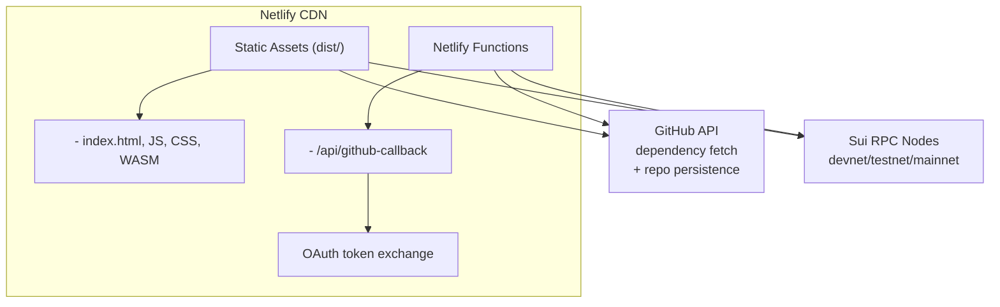
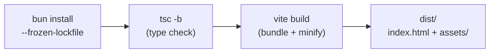

## Table of Contents

1. [Architecture Overview](#1-architecture-overview)
2. [Netlify Configuration](#2-netlify-configuration)
3. [Environment Variables](#3-environment-variables)
4. [Build Process](#4-build-process)
5. [Preview Deployments](#5-preview-deployments)
6. [Release Process](#6-release-process)
7. [Rollback Procedure](#7-rollback-procedure)
8. [Custom Domain & DNS](#8-custom-domain--dns)

---

## 1. Architecture Overview

Frontier Flow is a **static single-page application** with one serverless function:



---

## 2. Netlify Configuration

### 2.1 `netlify.toml`

```toml
[build]
  command = "bun install --frozen-lockfile && bun run build"
  publish = "dist"

[build.environment]
  NODE_VERSION = "24"
  BUN_VERSION = "latest"

# SPA routing: all paths serve index.html
[[redirects]]
  from = "/*"
  to = "/index.html"
  status = 200

# Security headers (see SECURITY.md §5)
[[headers]]
  for = "/*"
  [headers.values]
    X-Frame-Options = "DENY"
    X-Content-Type-Options = "nosniff"
    X-XSS-Protection = "0"
    Referrer-Policy = "strict-origin-when-cross-origin"
    Permissions-Policy = "camera=(), microphone=(), geolocation=(), interest-cohort=()"
    Strict-Transport-Security = "max-age=63072000; includeSubDomains; preload"
    Content-Security-Policy = "default-src 'self'; script-src 'self' 'wasm-unsafe-eval'; style-src 'self' 'unsafe-inline' https://fonts.googleapis.com; font-src 'self' https://fonts.gstatic.com; connect-src 'self' https://api.github.com https://raw.githubusercontent.com https://*.suifrens.com https://*.sui.io https://faucet.*.sui.io https://fullnode.*.sui.io; img-src 'self' data: blob:; worker-src 'self' blob:; object-src 'none'; frame-ancestors 'none'; base-uri 'self'; form-action 'self';"

# Cache immutable hashed assets aggressively
[[headers]]
  for = "/assets/*"
  [headers.values]
    Cache-Control = "public, max-age=31536000, immutable"
```

### 2.2 Serverless Function

The GitHub OAuth callback is located at `netlify/functions/github-callback.ts`:

```text
netlify/
└── functions/
    └── github-callback.ts   # Exchanges OAuth code for access token
```

This function:

1. Receives the authorisation `code` from GitHub's OAuth redirect
2. Exchanges the code for an access token using `GITHUB_CLIENT_SECRET`
3. Returns the token to the client
4. Validates `Origin`/`Referer` against an allowlist
5. Never logs or exposes the client secret

---

## 3. Environment Variables

### 3.1 Netlify Environment

| Variable               | Where to Set         | Purpose                                     | Sensitive |
| ---------------------- | -------------------- | ------------------------------------------- | --------- |
| `GITHUB_CLIENT_SECRET` | Netlify Environment  | OAuth token exchange in serverless function | **Yes**   |
| `GITHUB_CLIENT_ID`     | Source code (public) | OAuth initiation (client-side)              | No        |
| `NODE_VERSION`         | `netlify.toml`       | Node.js runtime for build                   | No        |

### 3.2 Local Development

For local development with the OAuth flow, create a `.env` file (already in `.gitignore`):

```env
VITE_GITHUB_CLIENT_ID=your_dev_client_id
```

> [!CAUTION]
> Never commit `.env` files or secrets to the repository. See [SECURITY.md §8](./SECURITY.md#8-secret-management).

---

## 4. Build Process

### 4.1 Build Pipeline



### 4.2 Build Commands

| Step            | Command                         | Output                  |
| --------------- | ------------------------------- | ----------------------- |
| Install         | `bun install --frozen-lockfile` | `node_modules/`         |
| Type check      | `bunx tsc -b`                   | Compile errors (if any) |
| Build           | `bun run build`                 | `dist/` directory       |
| Preview locally | `bun run preview`               | Local server at `:4173` |

### 4.3 Build Output

```text
dist/
├── index.html              # Entry point with hashed asset references
├── assets/
│   ├── index-[hash].js     # Application bundle
│   ├── index-[hash].css    # Compiled styles
│   └── vendor-[hash].js    # Vendor chunk (React, React Flow, etc.)
└── vite.svg                # Static assets
```

---

## 5. Preview Deployments

### 5.1 Automatic PR Previews

Every pull request targeting `main` automatically generates a Netlify deploy preview:

- **URL format:** `https://deploy-preview-{PR#}--{site-name}.netlify.app`
- Preview deploys use the same build configuration as production
- Preview environments **must not** use production secrets (see [SECURITY.md §3.3](./SECURITY.md#33-netlify-deployment-security))

### 5.2 Preview Review Process

1. PR author pushes changes
2. Netlify bot posts the preview URL as a PR comment
3. Reviewer opens the preview and verifies UI changes
4. CI passes in parallel

---

## 6. Release Process

### 6.1 Versioning

Follow [Semantic Versioning](https://semver.org/):

- **MAJOR** — Breaking changes to the node type system, IR format, or persistence schema
- **MINOR** — New node types, features, or enhancements
- **PATCH** — Bug fixes, documentation updates, dependency patches

### 6.2 Release Steps

```bash
# 1. Ensure main is up to date
git checkout main && git pull

# 2. Update version in package.json
bun version minor  # or major/patch

# 3. Update CHANGELOG.md with release notes

# 4. Commit and tag
git add -A
git commit -S -m "chore(release): v0.2.0"
git tag -s v0.2.0 -m "Release v0.2.0"

# 5. Push with tags
git push origin main --tags
```

### 6.3 Release Automation

Pushing a `v*` tag triggers the release workflow ([SECURITY.md §6.3](./SECURITY.md#63-release-attestation-workflow)):

1. Build production bundle
2. Generate SBOM (CycloneDX)
3. Generate SLSA build provenance attestation
4. Netlify deploys from `main` automatically

---

## 7. Rollback Procedure

### 7.1 Netlify Rollback

Netlify maintains a history of all deploys. To rollback:

1. Go to **Netlify Dashboard → Deploys**
2. Find the last known-good deploy
3. Click **"Publish deploy"** to re-activate it

This is instant and does not require a new build.

### 7.2 Git Revert

For code-level rollback:

```bash
git revert <commit-sha>
git push origin main
# Netlify auto-deploys the reverted state
```

---

## 8. Custom Domain & DNS

### 8.1 DNS Configuration

| Record Type | Host  | Value                     |
| ----------- | ----- | ------------------------- |
| CNAME       | `www` | `{site-name}.netlify.app` |
| A           | `@`   | Netlify load balancer IP  |

### 8.2 HTTPS

Netlify provides automatic Let's Encrypt SSL certificates for custom domains. HSTS is enforced via the security headers in `netlify.toml`.
