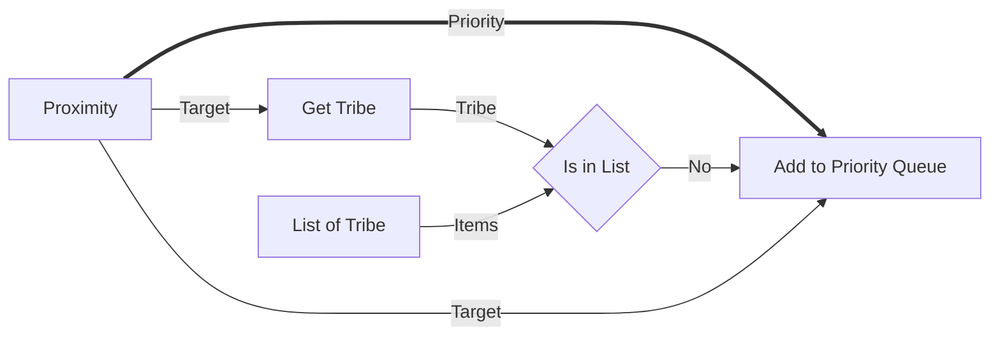

## Table of Contents

1. [Overview](#1-overview)
2. [Technology Stack](#2-technology-stack)
3. [Project Structure](#3-project-structure)
4. [Architecture](#4-architecture)
5. [Design System](#5-design-system)
6. [Components Specification](#6-components-specification)
7. [Custom Nodes Specification](#7-custom-nodes-specification)
8. [State Management](#8-state-management)
9. [Features](#9-features)
10. [Configuration Files](#10-configuration-files)
11. [Build & Development](#11-build--development)

---

## 1. Overview

### 1.1 Project Description

**Frontier Flow** is a visual low-code programming interface designed for creating workflows that translate into Sui Move smart contracts. Users can drag-and-drop visual nodes onto a canvas, connect them to define data flow, and generate corresponding Move code from the visual representation.

### 1.2 Core Capabilities

| Capability              | Description                                                                         |
| ----------------------- | ----------------------------------------------------------------------------------- |
| **Visual Node Editor**  | Interactive canvas using React Flow for node-based programming                      |
| **Drag-and-Drop**       | Sidebar toolbox with draggable node definitions                                     |
| **Edge Connections**    | Animated, colour-coded connections between node handles                             |
| **Auto Layout**         | Dagre-based algorithm to automatically arrange nodes and minimise crossings         |
| **Code Generation**     | Transforms visual flow into Sui Move smart contract code                            |
| **Sui Wallet**          | `@mysten/dapp-kit` integration for account connections and balances                 |
| **Contract Deployment** | Compiles Move via WASM and generates deployment transactions directly in-browser    |
| **Localnet Faucet**     | Native one-click localnet Sui faucet integration                                    |
| **Integrated Testing**  | Dual-environment testing engine (local TS evaluation + Sui Move test generation)    |
| **GitHub Integration**  | OAuth for increased API rate limits, dependency caching, and repository persistence |
| **Dark Theme**          | CCP Design System with premium dark UI, orange accents, and Disket Mono typography  |

### 1.3 Target Use Case

The application models game automation logic (e.g., EVE Frontier mechanics) where nodes represent:

- Event triggers
  - Turrets (Aggression, Proximity detection)
  - Gates (Can Jump)
- Data lookups (Get Tribe info)
- Logic gates (Is in List checks)
- Actions (Add to Priority Queue)

---

## 2. Technology Stack

### 2.1 Core Dependencies (Current)

| Package                           | Version  | Purpose                                |
| --------------------------------- | -------- | -------------------------------------- |
| `react`                           | ^19.2.0  | UI framework                           |
| `react-dom`                       | ^19.2.0  | React DOM renderer                     |
| `@xyflow/react`                   | ^12.10.0 | Visual node graph library (React Flow) |
| `lucide-react`                    | ^0.563.0 | Icon library                           |
| `dagre`                           | ^0.8.5   | Graph layout algorithm                 |
| `@types/dagre`                    | ^0.7.53  | Types for dagre                        |
| `react-syntax-highlighter`        | ^16.1.0  | Syntax highlighting for code           |
| `@types/react-syntax-highlighter` | ^15.5.13 | Types for syntax highlighter           |

### 2.2 Core Dependencies (Planned)

[!NOTE]
These packages are specified in the design but not yet added to `package.json`.

| Package                     | Version | Purpose                                  |
| --------------------------- | ------- | ---------------------------------------- |
| `@mysten/sui`               | latest  | Sui TS SDK for transactions              |
| `@mysten/dapp-kit`          | latest  | UI components for Sui Wallet integration |
| `@zktx.io/sui-move-builder` | latest  | In-browser WASM Sui Move compiler        |
| `idb-keyval`                | latest  | Promise-based IndexedDB for caching      |
| `@netlify/functions`        | latest  | Serverless functions for OAuth callback  |

### 2.3 Development Dependencies (Planned)

| Package                | Version             | Purpose                          |
| ---------------------- | ------------------- | -------------------------------- |
| `vite`                 | rolldown-vite@7.2.5 | Build tool (Rolldown fork)       |
| `typescript`           | ~5.9.3              | Type checking                    |
| `tailwindcss`          | ^4.1.18             | Utility-first CSS framework      |
| `@tailwindcss/postcss` | ^4.1.18             | PostCSS integration for Tailwind |
| `postcss`              | ^8.5.6              | CSS processing                   |
| `autoprefixer`         | ^10.4.24            | CSS vendor prefixing             |
| `eslint`               | ^10.0.0             | Code linting                     |
| `@vitejs/plugin-react` | ^5.1.1              | React plugin for Vite            |

### 2.4 Package Manager

The project uses **Bun** as the package manager.

---

## 3. Project Structure

```text
frontierflow/
├── index.html                    # Entry HTML file
├── package.json                  # Dependencies and scripts
├── vite.config.ts                # Vite configuration
├── tailwind.config.js            # Tailwind CSS configuration
├── postcss.config.js             # PostCSS configuration
├── tsconfig.json                 # TypeScript project references
├── tsconfig.app.json             # App TypeScript config
├── tsconfig.node.json            # Node TypeScript config
├── eslint.config.js              # ESLint configuration
├── public/                       # Static assets
│   └── vite.svg
└── src/
    ├── main.tsx                  # Application entry point
    ├── App.tsx                   # Root component with flow logic
    ├── index.css                 # Global styles + Tailwind import
    ├── components/
    │   ├── Header.tsx            # Top navigation bar
    │   ├── Sidebar.tsx           # Right-side toolbox panel
    │   ├── CodePreviewModal.tsx  # Modal for generated code display
    │   └── ErrorBoundary.tsx     # React error boundary wrapper
    ├── nodes/
    │   ├── index.ts              # Node type registry
    │   ├── AggressionNode.tsx    # Aggression event node
    │   ├── ProximityNode.tsx     # Proximity detection node
    │   ├── GetTribeNode.tsx      # Tribe lookup node
    │   ├── ListOfTribeNode.tsx   # Tribe list node
    │   ├── IsInListNode.tsx      # List membership check node
    │   ├── AddToQueueNode.tsx    # Queue action node
    │   ├── HpRatioNode.tsx       # HP ratio accessor node
    │   ├── ShieldRatioNode.tsx   # Shield ratio accessor node
    │   └── ArmorRatioNode.tsx    # Armor ratio accessor node
    └── utils/
        ├── moveCompiler.ts       # Move WASM compiler wrapper
        ├── codeGenerator.ts      # Move code generation logic
        ├── layoutEngine.ts       # Dagre-based auto-layout engine
        └── socketTypes.ts        # Socket definitions and coloring
```

---

## 4. Architecture

### 4.1 Component Hierarchy

For hierarchical code structure and internals, see [SOLUTION-DESIGN.md](./SOLUTION-DESIGN.md#1-component-hierarchy--internals).

### 4.2 Data Flow

```mermaid
flowchart TB
    subgraph App["App Component"]
        State["State: nodes, edges, isPreviewOpen, generatedCode"]

        State --Header
        State --DnDFlow
        State --Sidebar

        subgraph Header["Header"]
            onPreview["onPreview"]
        end

        subgraph DnDFlow["DnDFlow"]
            ReactFlow["ReactFlow Canvas"]
            DropHandler["Drop Handler"]
        end

        subgraph Sidebar["Sidebar"]
            Draggable["Draggable Nodes"]
        end

        Draggable -->|drag| DropHandler
        DropHandler -->|updates| ReactFlow
        onPreview --Modal

        Modal["CodePreviewModal"]
    end
```

### 4.3 React Flow Integration

The application uses `@xyflow/react` (React Flow v12) with:

- **ReactFlowProvider**: Context provider wrapping the entire app
- **useNodesState/useEdgesState**: Hooks for node/edge state management
- **useReactFlow**: Hook for accessing flow instance methods (e.g., `screenToFlowPosition`)
- **Custom Node Types**: Nine domain-specific node components

### 4.3.1 Example Flow



---

## 5. Design System

**Reference:** See the definitive [`DESIGN-SYSTEM.md`](./DESIGN-SYSTEM.md) for the complete typography stack, spacing, theming rules, and core variable names.

### 5.1 Colour Palette & Variables

The application relies on CSS variables for thematic consistency rather than hardcoded hex colours. These are mapped in `index.css` according to the conventions specified in the [Design System](./DESIGN-SYSTEM.md). Make sure to use values like `--bg-primary`, `--brand-orange`, and `--border-color`.

### 5.2 Socket Type System

**Design Pattern:** Typed sockets (similar to Blender's node editor)  
**Rule:** Only sockets of matching colours can be connected. Grey sockets accept any type.

#### Socket Data Types (Inheriting Core Move Types)

Domain-specific sockets map to 4 foundational Move types (`Signal`, `Entity`, `Value`, `Vector`). Their colors are standardized based on their parent Move type.

| Move Core | Domain Type | CSS Variable      | Value (from Design System) | Description                           |
| --------- | ----------- | ----------------- | -------------------------- | ------------------------------------- |
| `Signal`  | `boolean`   | `--socket-signal` | `var(--socket-signal)`     | Boolean/trigger signals               |
| `Entity`  | `rider`     | `--socket-entity` | `var(--socket-entity)`     | Rider/player references               |
| `Entity`  | `tribe`     | `--socket-entity` | `var(--socket-entity)`     | Tribe data structures                 |
| `Entity`  | `target`    | `--socket-entity` | `var(--socket-entity)`     | Generic targeting references          |
| `Value`   | `standing`  | `--socket-value`  | `var(--socket-value)`      | Standing/reputation values            |
| `Value`   | `wallet`    | `--socket-value`  | `var(--socket-value)`      | Wallet/financial data                 |
| `Value`   | `number`    | `--socket-value`  | `var(--socket-value)`      | Numeric values                        |
| `Value`   | `string`    | `--socket-value`  | `var(--socket-value)`      | Text/string values                    |
| `Vector`  | `list`      | `--socket-vector` | `var(--socket-vector)`     | Array/list data structures            |
| `Vector`  | `priority`  | `--socket-vector` | `var(--socket-vector)`     | Priority queue references             |
| `Any`     | `any`       | `--socket-any`    | `var(--socket-any)`        | Universal wildcard (accepts any type) |

##### Socket Connection Rules

See [SOLUTION-DESIGN.md](./SOLUTION-DESIGN.md#21-socket-connection-rules) for the exact compatibility matrix and validation functions.

##### Visual Socket Styling

See [SOLUTION-DESIGN.md](./SOLUTION-DESIGN.md#22-visual-socket-styling) for socket CSS definitions including hover and pulse animations.

##### Edge Styling by Move Core Type

| Move Core Type | Edge Colour (Variable) | Stroke Width | Animation |
| -------------- | ---------------------- | ------------ | --------- |
| `Signal`       | `var(--socket-signal)` | 2px          | Animated  |
| `Entity`       | `var(--socket-entity)` | 2px          | Animated  |
| `Value`        | `var(--socket-value)`  | 2px          | Animated  |
| `Vector`       | `var(--socket-vector)` | 3px          | Animated  |
| `Any`          | `var(--socket-any)`    | 2px          | Animated  |

**Note:** Edge colors are dynamically determined by the source socket type using `getSocketColorFromHandle`.

### 5.3 Typography and Shapes

Please refer to the [Design System Typography section](./DESIGN-SYSTEM.md#typography) for font configuration.
We natively load:

- `Disket Mono` for displays/headers.
- `Inter` for standard body.

**Important UI Note:** All generic shapes (buttons, cards, interface panels, nodes, and interactive sockets) have their border radius set to `0px` to maintain the technical industrial EVE Frontier look.

### 5.4 Visual Effects

| Effect            | Implementation                                                                              |
| ----------------- | ------------------------------------------------------------------------------------------- |
| **Glassmorphism** | `background: var(--card-bg); backdrop-filter: blur(12px);`                                  |
| **Shadows**       | `box-shadow: 0 4px 24px rgba(0, 0, 0, 0.5);`                                                |
| **Glow Effects**  | `box-shadow: 0 0 20px rgba(255, 71, 0, 0.3);` (Primary glow)                                |
| **Gradients**     | `background: linear-gradient(135deg, var(--brand-orange) 0%, var(--brand-dark) 100%);`      |
| **Transitions**   | `transition: all 200ms ease;` or `transition: colours 150ms ease;`                          |
| **Borders**       | `border: 1px solid var(--ui-border-dark);` or `border: 1px solid rgba(250, 250, 229, 0.1);` |

### 5.5 Node Styling (CCP Aligned)

#### Node Container

See [SOLUTION-DESIGN.md](./SOLUTION-DESIGN.md#32-common-ui-node-styling-ccp-aligned) for Node CSS configuration.

#### Handle Styles

| Handle Type | Move Core Type | Colour (Variable)      | Border |
| ----------- | -------------- | ---------------------- | ------ |
| Vector      | `Vector`       | `var(--socket-vector)` | None   |
| Entity      | `Entity`       | `var(--socket-entity)` | None   |
| Value       | `Value`        | `var(--socket-value)`  | None   |
| Signal      | `Signal`       | `var(--socket-signal)` | None   |
| Any         | `Any`          | `var(--socket-any)`    | None   |

---

## 6. Components Specification

### 6.1 Header Component

**File:** `src/components/Header.tsx`

See [SOLUTION-DESIGN.md](./SOLUTION-DESIGN.md#11-header-component-internals) for Header component props and logo SVG.

**Structure:**

- Fixed height: 64px (`h-16`)
- Horizontal layout with space-between
- Left section: Logo + App name
- Right section: Version badge, Actions (Auto Arrange, Preview), GitHub Sync, Network Selector, Wallet Info, Deploy, Connect Button

**Buttons & Controls:**

- **Auto Arrange:** Secondary style, utilizes `dagre` layout engine (`LayoutGrid` icon)
- **Preview Code:** Secondary style (`Code2` icon)
- **GitHub Sync:** Action menu for OAuth login and repository persistence (`Github` icon)
- **Network Selector:** Dropdown for localnet, devnet, testnet, mainnet
- **Get Tokens:** Visible on localnet when balance is 0. Calls Sui faucet.
- **Wallet Info:** Shows abbreviated address/SNS and Sui balance when connected.
- **Deploy:** Primary style (`btn-primary`, CCP orange `var(--brand-orange)`). Triggers WASM compilation and transaction signing.
- **Connect Wallet:** `@mysten/dapp-kit` ConnectButton (no security trimming required)

---

### 6.2 Sidebar Component

**File:** `src/components/Sidebar.tsx`

**Layout:**

- Fixed width: 320px (`w-80`)
- Three sections: Header, Scrollable content, Footer
- Right-side positioned with left border

See [SOLUTION-DESIGN.md](./SOLUTION-DESIGN.md#12-sidebar-component-internals) for node definitions array and Drag event handlers.

---

### 6.3 CodePreviewModal Component

**File:** `src/components/CodePreviewModal.tsx`

See [SOLUTION-DESIGN.md](./SOLUTION-DESIGN.md#13-codepreviewmodal-internals) for Modal props and Copy to clipboard implementation.

**Features:**

- Conditional rendering based on `isOpen`
- Full-screen overlay with backdrop blur
- Fixed max-width: 900px (`max-w-4xl`)
- Copy to clipboard functionality with visual feedback
- **Syntax Highlighting**: Uses `react-syntax-highlighter` with `vscDarkPlus` theme
- Line numbers enabled

---

### 6.4 ErrorBoundary Component

**File:** `src/components/ErrorBoundary.tsx`

**Type:** React Class Component (required for error boundaries)

See [SOLUTION-DESIGN.md](./SOLUTION-DESIGN.md#14-errorboundary-state) for ErrorBoundary internal state properties.

**Methods:**

- `getDerivedStateFromError`: Captures error into state
- `componentDidCatch`: Logs error to console
- `render`: Shows error UI or children

---

### 6.5 DnDFlow Component (Internal)

**Location:** Defined within `src/App.tsx`

See [SOLUTION-DESIGN.md](./SOLUTION-DESIGN.md#15-dndflow-configuration) for DnDFlow props, ReactFlow provider setup, and Drag-and-Drop hook implementations.

---

## 7. Custom Nodes Specification

### 7.1 Node Type Registry

**File:** `src/nodes/index.ts`

See [SOLUTION-DESIGN.md](./SOLUTION-DESIGN.md#31-node-type-registry) for the mapping of node types to React components.

### 7.2 Common Node Structure

All custom nodes follow this pattern:

1. Import `Handle`, `Position`, `NodeProps` from `@xyflow/react`
2. Import relevant Lucide icon
3. Accept `{ data }: NodeProps` as props
4. Display `data.label as string` in header
5. Define input/output handles with unique IDs

**Common Styling Classes (CCP Aligned):**

See [SOLUTION-DESIGN.md](./SOLUTION-DESIGN.md#32-common-ui-node-styling-ccp-aligned) for the shared CSS classes applied to custom nodes.

### 7.3 Individual Node Specifications

**Socket Format:** `socketId` (Position, Type, Direction) - Description

#### AggressionNode

- **Icon:** `Swords`
- **Category:** Event Trigger
- **Description:** Triggered when an aggression event occurs between two riders
- **Sockets (Output only):**

| Socket ID   | Position | Type       | Colour    | Description                |
| ----------- | -------- | ---------- | --------- | -------------------------- |
| `priority`  | Right    | `priority` | `#9b59b6` | Priority queue to populate |
| `aggressor` | Right    | `rider`    | `#54a0ff` | The attacking rider        |
| `victim`    | Right    | `rider`    | `#54a0ff` | The attacked rider         |

#### ProximityNode

- **Icon:** `Radar`
- **Category:** Event Trigger
- **Description:** Triggered when an entity enters detection range
- **Sockets (Output only):**

| Socket ID  | Position | Type       | Colour    | Description                |
| ---------- | -------- | ---------- | --------- | -------------------------- |
| `priority` | Right    | `priority` | `#9b59b6` | Priority queue to populate |
| `target`   | Right    | `target`   | `#54a0ff` | Detected entity reference  |

#### GetTribeNode (Get Tribe)

- **Icon:** `UserSearch`
- **Category:** Data Transformer
- **Description:** Expands a rider reference into its component data
- **Sockets:**

| Socket ID  | Position | Type       | Colour    | Direction | Description      |
| ---------- | -------- | ---------- | --------- | --------- | ---------------- |
| `rider`    | Left     | `rider`    | `#54a0ff` | Input     | Rider to expand  |
| `tribe`    | Right    | `tribe`    | `#54a0ff` | Output    | Rider's tribe    |
| `standing` | Right    | `standing` | `#1abc9c` | Output    | Rider's standing |
| `wallet`   | Right    | `wallet`   | `#1abc9c` | Output    | Rider's wallet   |

#### ListOfTribeNode

- **Icon:** `List`
- **Category:** Data Source
- **Description:** Provides a list of tribe IDs for comparison
- **Sockets:**

| Socket ID | Position | Type   | Colour    | Direction | Description        |
| --------- | -------- | ------ | --------- | --------- | ------------------ |
| `items`   | Right    | `list` | `#9b59b6` | Output    | List of tribe data |

#### IsInListNode

- **Icon:** None (diamond shape)
- **Category:** Logic Gate
- **Special Shape:** 45° rotated square (diamond)
- **Description:** Checks if an item exists within a list
- **Sockets:**

| Socket ID    | Position | Type      | Colour    | Direction | Description              |
| ------------ | -------- | --------- | --------- | --------- | ------------------------ |
| `input_item` | Left     | `any`     | `#6b6b5e` | Input     | Item to check (any type) |
| `input_list` | Top      | `list`    | `#9b59b6` | Input     | List to check against    |
| `yes`        | Right    | `boolean` | `#fafae5` | Output    | True if item in list     |
| `no`         | Right    | `boolean` | `#fafae5` | Output    | True if item not in list |

#### AddToQueueNode

- **Icon:** `Layers`
- **Category:** Action
- **Description:** Adds an entity to the priority queue
- **Sockets:**

| Socket ID      | Position | Type       | Colour    | Direction | Description              |
| -------------- | -------- | ---------- | --------- | --------- | ------------------------ |
| `priority_in`  | Left     | `priority` | `#9b59b6` | Input     | Priority queue reference |
| `predicate`    | Left     | `boolean`  | `#fafae5` | Input     | Execution predicate      |
| `entity`       | Left     | `any`      | `#6b6b5e` | Input     | Entity to add (any type) |
| `priority_out` | Right    | `priority` | `#9b59b6` | Output    | Modified priority queue  |

#### HpRatioNode

- **Icon:** `Heart`
- **Category:** Data Accessor
- **Description:** Reads the HP ratio (0-100) from a target entity
- **Sockets:**

| Socket ID  | Position | Type     | Colour    | Direction | Description              |
| ---------- | -------- | -------- | --------- | --------- | ------------------------ |
| `target`   | Left     | `target` | `#54a0ff` | Input     | Target entity to inspect |
| `hp_ratio` | Right    | `number` | `#1abc9c` | Output    | HP ratio value (0-100)   |

#### ShieldRatioNode

- **Icon:** `Shield`
- **Category:** Data Accessor
- **Description:** Reads the shield ratio (0-100) from a target entity
- **Sockets:**

| Socket ID      | Position | Type     | Colour    | Direction | Description                |
| -------------- | -------- | -------- | --------- | --------- | -------------------------- |
| `target`       | Left     | `target` | `#54a0ff` | Input     | Target entity to inspect   |
| `shield_ratio` | Right    | `number` | `#1abc9c` | Output    | Shield ratio value (0-100) |

#### ArmorRatioNode

- **Icon:** `ShieldHalf`
- **Category:** Data Accessor
- **Description:** Reads the armor ratio (0-100) from a target entity
- **Sockets:**

| Socket ID     | Position | Type     | Colour    | Direction | Description               |
| ------------- | -------- | -------- | --------- | --------- | ------------------------- |
| `target`      | Left     | `target` | `#54a0ff` | Input     | Target entity to inspect  |
| `armor_ratio` | Right    | `number` | `#1abc9c` | Output    | Armor ratio value (0-100) |

### 7.4 Node Template Structure

Based on the reference design, all nodes follow this template structure:

```mermaid
flowchart TB
    subgraph Node["Node Container"]
        subgraph Header["Header: NODE TYPE / NODE NAME"]
        end
        subgraph Body["Body"]
            direction LR
            Input["Input Socket"] --Content["Node Content"]
            Content --Output1["Output Socket 1"]
            Content --Output2["Output Socket 2"]
            Content --Output3["Output Socket 3"]
        end
    end
```

**Node Header Structure:**

- Line 1: Node type (smaller, uppercase)
- Line 2: Node name/label (larger)
- Delete icon (trash) aligned to the right

**Socket Placement:**

- Input sockets: Left side of node body
- Output sockets: Right side of node body
- Socket colors indicate data type
- Labels appear next to sockets

### 7.5 Socket Implementation

See [SOLUTION-DESIGN.md](./SOLUTION-DESIGN.md#23-socket-implementation) for socket interfaces, type enumerations, and runtime colour mapping logic.

### 7.6 Connection Validation Hook

See [SOLUTION-DESIGN.md](./SOLUTION-DESIGN.md#24-connection-validation-hook) for the `useConnectionValidation` hook tying visual sockets to validation logic.

---

## 8. State Management

See [SOLUTION-DESIGN.md](./SOLUTION-DESIGN.md#4-state-management-initialization) for React state hooks, initial node layouts, and predefined edge connections.

---

## 9. Features

### 9.1 Code Generation

**File:** `src/utils/codeGenerator.ts`

**Function Signature:**

```typescript
export const generateMoveCode = (nodes: Node[]): string ={ ... }
```

**Output Structure:**

See [SOLUTION-DESIGN.md](./SOLUTION-DESIGN.md#5-code-generation-outputs) for a complete example of generated Move code module structure.

**Node-to-Code Mapping:**

**On-Chain Context:** The generated code targets the `builder_extensions` pattern defined in `world::turret`. The world contract provides default targeting logic via `world::turret::get_target_priority_list()`. When an extension is configured (via `authorize_extension<Auth>`), the world contract's default function aborts with error code 7 (`EExtensionConfigured`), and the game server resolves the package ID from the configured type name and calls the extension's `get_target_priority_list` function directly. Frontier Flow generates extension contracts that implement custom targeting logic using the `TargetCandidate` struct, `ReturnTargetPriorityList` return entries, and `OnlineReceipt` proof pattern. The extension function receives BCS-serialized `vector<TargetCandidate>` and returns BCS-serialized `vector<ReturnTargetPriorityList>`.

| Node Type     | Generated Code                                                                                                                 |
| ------------- | ------------------------------------------------------------------------------------------------------------------------------ |
| `aggression`  | `turret::candidate_is_aggressor(&candidate)` — checks the `is_aggressor` field on `TargetCandidate`                            |
| `proximity`   | Entry point: `get_target_priority_list(turret, owner_character, target_candidate_list, receipt)`                               |
| `getTribe`    | `turret::candidate_character_tribe(&candidate)` — reads tribe ID (u32) from target candidate                                   |
| `listOfTribe` | `let friendly_tribes: vector<u32= vector[tribe_1, tribe_2, ...]` — static tribe list                                         |
| `isInList`    | Tribe comparison: `turret::candidate_character_tribe(&candidate) == character::tribe(owner_character)`                         |
| `addToQueue`  | `vector::push_back(&mut return_list, turret::new_return_target_priority_list(item_id, weight))` — appends entry to return list |
| `hpRatio`     | `turret::candidate_hp_ratio(&candidate)` — reads HP ratio (0-100) from target candidate                                        |
| `shieldRatio` | `turret::candidate_shield_ratio(&candidate)` — reads shield ratio (0-100) from target candidate                                |
| `armorRatio`  | `turret::candidate_armor_ratio(&candidate)` — reads armor ratio (0-100) from target candidate                                  |

#### 9.1.1 Compilation Optimisation — AST Pruning & Gas Efficiency

Visual programming tools are inherently susceptible to **code bloat**: orphaned branches, redundant data transformations, and unoptimised vector operations that survive the Constraint Engine because they are technically _valid_ but not _lean_. On a resource-oriented blockchain where every opcode costs gas, this is unacceptable.

Before the Emitter phase, the compilation pipeline executes a dedicated **AST Pruning & Optimisation** pass against the validated Intermediate Representation:

| Optimisation                 | Description                                                                                                                                                                                                             |
| ---------------------------- | ----------------------------------------------------------------------------------------------------------------------------------------------------------------------------------------------------------------------- |
| **Dead Branch Elimination**  | Strips logic sub-trees whose output sockets feed no downstream consumer. A `GetTribe` node whose outputs are entirely unconnected produces zero emitted code.                                                           |
| **Redundant Vector Folding** | Detects duplicate `vector::contains` or `vector::push_back` calls operating on identical inputs and collapses them into a single instruction with a shared result binding.                                              |
| **Constant Propagation**     | If a `ListOfTribe` node defines a static list with only one element, the emitter may replace `vector::contains(list, &item)` with a direct equality check — eliminating the vector allocation entirely.                 |
| **Gas-Cost Annotation**      | Each IR node is annotated with an estimated gas weight. The optimiser reorders independent operations to front-load cheap checks (e.g., boolean guards) before expensive lookups, enabling early-exit short-circuiting. |

See [SOLUTION-DESIGN.md §5.3.2](./SOLUTION-DESIGN.md#532-phase-35-ast-pruning--gas-optimization) for the optimiser's internal implementation details and TypeScript interfaces.

### 9.2 Deployment Integration

**Capabilities:**

1. **Wallet Connection:** Uses Sui `dapp-kit` to connect user wallets without security trimming. Displays abbreviated addresses/SNS and SUI balances.
2. **Network Support:** Multi-network selection (localnet, devnet, testnet, mainnet).
3. **Local Faucet:** Integrated button to request tokens on localnet if the current balance is 0.
4. **Move Compilation:** Leverages `@zktx.io/sui-move-builder/lite` to compile generated Move code entirely in-browser (WASM).
5. **Transaction Submittal:** Generates the contract publishing transaction using compiled bytecode and dependencies, prompting the user for approval.
6. **Toast Notifications:** Displays compilation progress and success/failure results via UI toasters.
7. **Package Upgrades:** Enables upgrading previously deployed Sui packages in-place, preserving on-chain state while replacing the bytecode. Critical for iterating on Smart Assembly logic (e.g., updating a turret's friend-or-foe target list) without redeploying an entirely new object.

#### 9.2.1 Package Upgrade Flow

Publishing a _new_ package is only half the deployment story. In EVE Frontier, players will routinely iterate on their automation logic — adjusting proximity thresholds, modifying tribe allowlists, or swapping priority queue strategies. The system must support upgrading an **existing** on-chain package without losing its shared object state.

**Upgrade Lifecycle:**

```mermaid
flowchart LR
    A["User edits graph"] --B["Compile via WASM"]
    B --C{"First deploy?"}
    C -->|Yes| D["txb.publish() → UpgradeCap"]
    C -->|No| E["txb.upgrade() with stored UpgradeCap"]
    D --F["Store UpgradeCap reference in IndexedDB"]
    E --G["Commit upgrade digest → authorise"]
    G --H["On-chain package bytecode replaced"]
```

**Key Mechanics:**

| Concern                  | Resolution                                                                                                                                                                             |
| ------------------------ | -------------------------------------------------------------------------------------------------------------------------------------------------------------------------------------- |
| **UpgradeCap Retrieval** | After the first `publish`, the `UpgradeCap` object ID is persisted in IndexedDB (keyed by package name + network). Subsequent deploys retrieve this cap automatically.                 |
| **Compatibility Policy** | The UI defaults to `UpgradePolicy::Compatible`, ensuring struct layouts and public function signatures remain stable. A warning modal is shown if the user attempts a policy override. |
| **Digest Authorisation** | The upgrade transaction calls `package::authorise_upgrade` with the compiled digest before committing the new bytecode modules.                                                        |
| **UI Signaling**         | The Deploy button dynamically switches between "Deploy" (new) and "Upgrade" (existing) based on whether a stored `UpgradeCap` exists for the active network + package combination.     |

See [SOLUTION-DESIGN.md §5.7.1](./SOLUTION-DESIGN.md#571-package-upgrade-flow) for the full TypeScript transaction construction.

### 9.3 GitHub Integration & Persistence

**Capabilities:**

1. **OAuth Authentication:** "Login with GitHub" flow to authenticate the user and obtain an access token. This increases the GitHub API rate limit from 60 to 5,000 requests per hour, preventing limits from being hit during WASM compilation dependency fetching.
2. **Dependency Caching:** Uses `idb-keyval` (IndexedDB) to locally cache fetched GitHub dependencies (e.g., the Sui Framework logic) with an expiration TTL, minimizing redundant API requests.
3. **Save Graph to Repo:** Persists the current visual `ReactFlow` graph state as a `.json` file to the user's connected GitHub repository, enabling cloud saving and loading.
4. **Commit Generated Code:** Allows the user to directly commit the compiled `.move` contract code to their GitHub repository for long-term storage and CI/CD pipelines.

### 9.4 Integrated Testing Engine

**Capabilities:**

1. **Test Panel UI:** An interface to define multiple test cases, allowing users to mock external inputs and assert expected output states.
2. **Dual-Environment Execution:**
   - **Local Evaluation:** Instantly evaluates the graph using a TypeScript AST walker for fast visual feedback.
   - **Move Compilation:** Translates the tests into `#[test]` modules and mock-state wrappers within the generated Move code to ensure true on-chain parity.
3. **Visual Error Tracing:** Correlates test failures back to specific React Flow Node IDs, highlighting the exact node where an assertion or type constraint failed.
4. **Compiler Error Traceability:** When a graph passes the local Constraint Engine but fails during the actual WASM Sui Move compilation, native compiler errors are intercepted and mapped back to the originating React Flow Node. The Emitter annotates each generated code line with an AST Node ID comment (e.g., `// @ff-node:dnd_3_1708642800000`). A regex parser extracts line numbers from the Move compiler's error output, cross-references them against the emitted source map, resolves the originating AST Node ID, and highlights the responsible canvas node with a `.node-error-highlight` CSS class. This eliminates cryptic compiler output for non-technical users.

See [SOLUTION-DESIGN.md §5.4.1](./SOLUTION-DESIGN.md#541-compiler-error--node-mapping) for the full source map interface and error parsing implementation.

---

## 10. Configuration Files

Configuration files (`package.json`, `vite.config.ts`, `tailwind.config.js`, `postcss.config.js`, `index.css`, `index.html`) contain boilerplates and low-level build settings.
>
See [SOLUTION-DESIGN.md](./SOLUTION-DESIGN.md#6-configuration-files) for their complete contents and setups.

---

## 11. Build & Development

### 11.1 Installation

```bash
bun install
```

### 11.2 Development Server

```bash
bun dev
# Access at http://localhost:5173
```

### 11.3 Production Build

```bash
bun run build
# Output in ./dist/
```

### 11.4 Preview Production Build

```bash
bun run preview
```

### 11.5 Linting

```bash
bun run lint
```

---

## Appendix A: File-by-File Checklist

| File                                  | Status   | Notes             |
| ------------------------------------- | -------- | ----------------- |
| `index.html`                          | Required | Entry point       |
| `package.json`                        | Required | Dependencies      |
| `vite.config.ts`                      | Required | Build config      |
| `tailwind.config.js`                  | Required | CSS config        |
| `postcss.config.js`                   | Required | PostCSS           |
| `tsconfig.json`                       | Required | TS config         |
| `src/main.tsx`                        | Required | App entry         |
| `src/App.tsx`                         | Required | Root component    |
| `src/index.css`                       | Required | Global styles     |
| `src/components/Header.tsx`           | Required | Navigation        |
| `src/components/Sidebar.tsx`          | Required | Toolbox           |
| `src/components/CodePreviewModal.tsx` | Required | Code display      |
| `src/components/ErrorBoundary.tsx`    | Required | Error handling    |
| `src/nodes/index.ts`                  | Required | Node registry     |
| `src/nodes/*.tsx`                     | Required | 9 node components |
| `src/utils/codeGenerator.ts`          | Required | Code generation   |

---

## Appendix B: Icon Reference

| Component        | Icon           | Lucide Import   |
| ---------------- | -------------- | --------------- |
| Header (Preview) | Code brackets  | `Code2`         |
| Header (Close)   | X mark         | `X`             |
| CodePreviewModal | Copy/Check     | `Copy`, `Check` |
| AggressionNode   | Crossed swords | `Swords`        |
| ProximityNode    | Radar sweep    | `Radar`         |
| GetTribeNode     | User search    | `UserSearch`    |
| ListOfTribeNode  | List           | `List`          |
| AddToQueueNode   | Stacked layers | `Layers`        |
| HpRatioNode      | Heart          | `Heart`         |
| ShieldRatioNode  | Shield         | `Shield`        |
| ArmorRatioNode   | Shield half    | `ShieldHalf`    |
