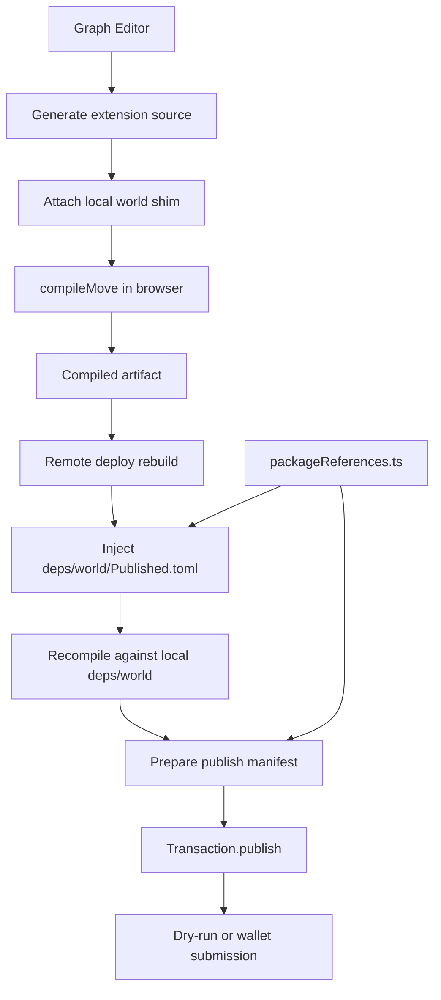
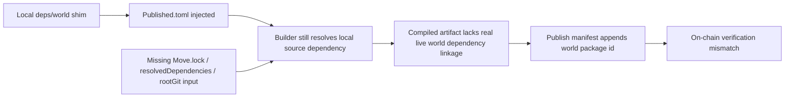
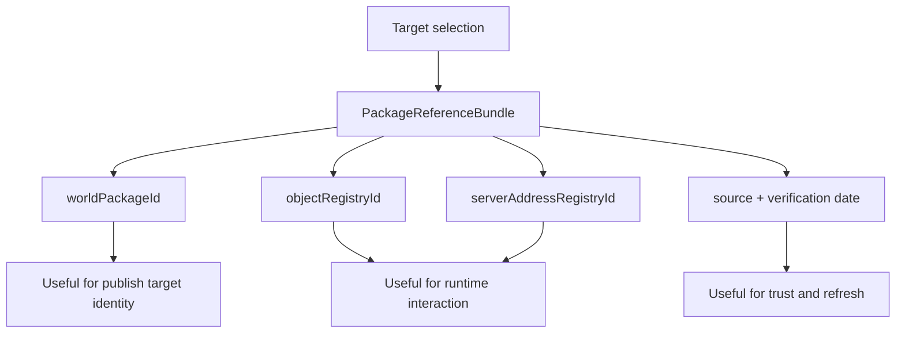
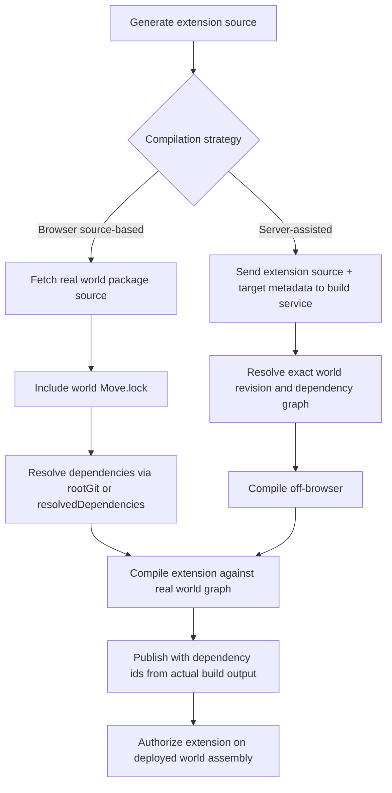

> **Status Update:** This document’s analysis resulted in [ADR-009: Separate Authoring Compilation from Deploy-Grade Dependency Resolution](./ADR/ADR-009-deploy-grade-dependency-resolution.md), which has been **accepted**. The recommended direction (§10) is now the approved architecture.

## Table of Contents

1. [Purpose](#1-purpose)
2. [Current State Summary](#2-current-state-summary)
3. [Current End-to-End Flow](#3-current-end-to-end-flow)
4. [Why the Current Flow Fails](#4-why-the-current-flow-fails)
5. [What Metadata Frontier Flow Already Has](#5-what-metadata-frontier-flow-already-has)
6. [What Is Still Missing](#6-what-is-still-missing)
7. [Target End-to-End Shape](#7-target-end-to-end-shape)
8. [Target Metadata Contract](#8-target-metadata-contract)
9. [Implementation Options](#9-implementation-options)
10. [Recommended Direction](#10-recommended-direction)
11. [Open Questions](#11-open-questions)

---

## 1. Purpose

This document explains the exact dependency-resolution problem behind Frontier Flow remote deployment and lays out the end-to-end shape required to compile and publish a working extension package against a live EVE Frontier `world` deployment.

It is intended to answer four questions:

1. What Frontier Flow does today during browser-based compilation and remote deploy.
2. Why the current `world` shim plus injected `Published.toml` path does not produce a deployable extension.
3. What metadata and resolution inputs are required for a real published dependency link.
4. What implementation shapes are realistic with the current WASM builder and toolchain.

---

## 2. Current State Summary

Frontier Flow currently compiles generated extension code in the browser using `@zktx.io/sui-move-builder/lite`.

The application models the `world` dependency in two different ways:

1. During normal browser compilation it uses a local shim package with a minimal subset of `world` modules.
2. During remote deployment it tries to keep using that local shim while injecting a generated `deps/world/Published.toml` file that points at the target network's deployed `world` package.

That approach is not sufficient.

The current builder invocation in `src/compiler/moveCompiler.ts` passes only:

- in-memory files
- `network`
- `silenceWarnings`

It does not currently pass:

- `Move.lock`
- `rootGit`
- `resolvedDependencies`

Those omitted inputs matter because they are the inputs the builder exposes for deterministic dependency resolution.

---

## 3. Current End-to-End Flow

### 3.1 Runtime Responsibilities

- `src/compiler/worldShim.ts`
  - Defines the local `world` shim used during browser compilation.
- `src/compiler/moveCompiler.ts`
  - Compiles the generated artifact with the WASM builder.
- `src/data/packageReferences.ts`
  - Stores target-specific `worldPackageId`, `objectRegistryId`, and `serverAddressRegistryId` values.
- `src/deployment/publishRemote.ts`
  - Rebuilds the artifact for remote deploy and injects `deps/world/Published.toml`.

### 3.2 Current Flow Diagram



### 3.3 Current Artifact Shape

The remote flow currently rebuilds a package that still declares:

```toml
[dependencies]
world = { local = "deps/world" }
```

The generated `Published.toml` is added beside that local dependency, but the dependency itself remains a local package in the compile graph.

---

## 4. Why the Current Flow Fails

There are two different failure modes, both pointing at the same architectural problem.

### 4.1 Failure Mode A: `address with no value`

When the root remote manifest omits `world = "0x0"` from `[addresses]`, the browser compiler fails before publish with an address-resolution error.

This shows that the generated package is still being treated as a source-compiled dependency graph, not as a package that has already been resolved to a deployed dependency.

### 4.2 Failure Mode B: Verification failure after compile

When the root remote manifest restores `world = "0x0"`, compilation can succeed, but the produced dependency list still does not include the live `world` package.

That leads to a publish dry-run failure such as `VMVerificationOrDeserializationError`, because the compiled package bytecode and the declared dependency set do not match the actual deployed dependency expectations.

### 4.3 Why `Published.toml` Is Not Enough

`Published.toml` is publication metadata. It tells the toolchain about package identity for an already resolved package. It is not a substitute for actual dependency resolution input.

In practical terms, Frontier Flow is currently supplying:

- a local source dependency
- one published package id
- no lockfile-backed resolution graph

That is enough to describe intent, but not enough to make the builder treat `world` as a correctly linked deployed dependency.

### 4.4 Current Failure Diagram



---

## 5. What Metadata Frontier Flow Already Has

Today Frontier Flow has enough metadata to identify which remote deployment target it wants to work against.

The package reference bundle currently stores:

- `targetId`
- `environmentLabel`
- `worldPackageId`
- `objectRegistryId`
- `serverAddressRegistryId`
- `source`
- `lastVerifiedOn`

It can also refresh `worldPackageId` values from upstream `contracts/world/Published.toml`.

That is useful for:

- validation
- UI readiness checks
- choosing the correct target package ids
- forming user-facing deployment context

It is not enough to reconstruct the compile-time dependency graph required by the builder.

### 5.1 Metadata Frontier Flow Already Knows



---

## 6. What Is Still Missing

The missing data is not just a single additional package id.

### 6.1 Missing Resolution Inputs

To resolve a real dependency graph, the builder typically needs one or more of the following:

- a `Move.lock` file for the package being compiled or fetched
- `rootGit` metadata so local dependencies can be interpreted relative to a known git source
- `resolvedDependencies` produced by a prior dependency-resolution pass

Frontier Flow does not currently provide any of these inputs during browser compilation.

### 6.2 Missing Source Identity for `world`

For a source-based path, Frontier Flow would need to know more than just the deployed package id.

It would need a durable source identity for the exact `world` package revision used for compilation, for example:

- git repository URL
- revision / commit SHA
- subdirectory
- expected network or environment mapping

### 6.3 Missing Transitive Dependency Closure

Even if `world` itself is identified correctly, its own dependencies must still be resolved consistently.

That requires either:

- the lockfile and source tree for the exact `world` revision
- or a serialized `resolvedDependencies` payload
- or future bytecode-only dependency support in the builder

### 6.4 Missing Bytecode-Only Linkage Path

If the desired end state is to compile the extension without fetching or compiling the upstream `world` source, the builder would need a bytecode-only dependency mode.

That would require different inputs again, such as:

- deployed package bytecode or a bytecode dependency manifest
- package identity metadata by network
- module layout and dependency closure metadata

That does not appear to be the current browser path.

---

## 7. Target End-to-End Shape

There are two realistic architectural shapes.

### 7.1 Shape A: Source-Resolved Browser Compilation

This is the closest match to the builder's current model.

End-to-end:

1. Frontier Flow generates the extension package source.
2. The extension declares `world` as a real external dependency, not a local shim.
3. Frontier Flow fetches the exact `world` package source files, including `Move.lock`.
4. The builder resolves that package and its transitive dependencies using either:
   - the fetched `Move.lock`
   - `rootGit`
   - or precomputed `resolvedDependencies`
5. The extension is compiled against the actual `world` source graph.
6. The compile result dependency ids already match the intended package graph.
7. The publish transaction reuses those dependency ids without manual patching.

### 7.2 Shape B: Server-Assisted or Bytecode-Resolved Compilation

This is the fallback if browser-side source compilation remains incompatible with upstream `world`.

End-to-end:

1. Frontier Flow generates the extension source in-browser.
2. A server-side compiler or another trusted build service resolves the exact target dependency graph.
3. The service compiles the package against the correct `world` revision and network metadata.
4. It returns:
   - compiled modules
   - dependency ids
   - digest / provenance metadata
5. Frontier Flow asks the wallet to publish those compiled modules.

### 7.3 Target Flow Diagram



---

## 8. Target Metadata Contract

The minimum useful metadata model for a source-resolved path is larger than the current `PackageReferenceBundle`.

### 8.1 Proposed `ResolvedWorldReference`

```ts
interface ResolvedWorldReference {
  readonly targetId: "testnet:stillness" | "testnet:utopia";
  readonly network: "testnet" | "mainnet" | "devnet";
  readonly environmentLabel: string;
  readonly publishedPackageId: string;
  readonly originalPackageId?: string;
  readonly objectRegistryId: string;
  readonly serverAddressRegistryId: string;
  readonly sourceRepositoryUrl: string;
  readonly sourceRevision: string;
  readonly sourceSubdir: string;
  readonly moveLockContents?: string;
  readonly publishedManifestContents?: string;
  readonly lastVerifiedOn: string;
}
```

### 8.2 Why Each Field Matters

| Field | Purpose |
| --- | --- |
| `publishedPackageId` | On-chain target package identity |
| `originalPackageId` | Compile-time identity if upstream distinguishes original vs published ids |
| `sourceRepositoryUrl` | Tells the resolver where `world` source comes from |
| `sourceRevision` | Pins the exact source revision |
| `sourceSubdir` | Needed because `world` lives under `contracts/world` |
| `moveLockContents` | Allows deterministic transitive dependency resolution |
| `publishedManifestContents` | Provides published environment metadata for the target network |

### 8.3 Optional Cached Resolution Layer

If Frontier Flow wants browser startup to remain fast, it can store a cached resolved layer:

```ts
interface CachedWorldResolution {
  readonly reference: ResolvedWorldReference;
  readonly resolvedDependencies: {
    readonly files: string;
    readonly dependencies: string;
    readonly lockfileDependencies: string;
  };
  readonly generatedAt: string;
}
```

That would move the expensive dependency walk out of the hot deploy path.

---

## 9. Implementation Options

### 9.1 Option A: Replace the Shim for Remote Deploy Only

Keep the local shim for fast in-browser authoring and compile previews, but switch remote deployment to a real source-resolved path.

Advantages:

- preserves current fast authoring loop
- minimizes disruption to the non-deploy compiler path
- isolates the expensive or fragile resolution work to deploy time

Tradeoffs:

- preview compile and deploy compile no longer use exactly the same dependency graph
- deploy can still fail if the upstream source revision is incompatible with the bundled WASM toolchain

### 9.2 Option B: Replace the Shim Entirely

Compile all extension packages against the real `world` source graph all the time.

Advantages:

- maximum parity between preview compile and deploy compile
- fewer special cases in compiler behavior

Tradeoffs:

- much heavier browser compilation path
- larger dependency fetches
- more brittle authoring experience if upstream changes often

### 9.3 Option C: Server-Assisted Build for Deploy

Use browser compilation for fast feedback, but delegate deploy-grade compilation to a server-side toolchain.

Advantages:

- avoids browser WASM compatibility limits
- can use the exact Sui CLI toolchain expected by upstream `world`
- can cache resolved world revisions centrally

Tradeoffs:

- adds infrastructure and trust boundaries
- requires explicit provenance and integrity guarantees

---

## 10. Recommended Direction

The following approach has been formalised as [ADR-009](./ADR/ADR-009-deploy-grade-dependency-resolution.md) and is now the accepted architecture.

The lowest-risk near-term path is:

1. Keep the local `world` shim for authoring and lightweight preview compile.
2. Stop treating injected `Published.toml` as sufficient for remote dependency resolution.
3. Introduce a deploy-only resolution model that uses a real upstream `world` source identity.
4. Treat `contracts/world/Move.lock` as an input to that deploy-only resolution path.
5. If the bundled browser toolchain still cannot compile the upstream `world` source revision, move deploy-grade compilation to a server-side builder.

This splits the problem into two clear layers:

- authoring compatibility
- deploy-grade dependency resolution

That split matches the current practical constraints better than trying to force the shim-based browser path into acting like a full published dependency resolver.

---

## 11. Open Questions

1. Can the bundled WASM builder compile a pinned revision of `evefrontier/world-contracts` if tests are excluded and the toolchain version matches exactly?
2. Does the builder support enough `Move.lock` semantics in-browser for `contracts/world/Move.lock` to be reused directly without a server-side preprocessing step?
3. Is bytecode-only dependency linking planned soon enough to justify waiting for it rather than building a source-resolved path?
4. Should Frontier Flow persist a full `ResolvedWorldReference` per target in local storage, or refresh it from a maintained manifest service?
5. Should deploy-grade compilation be considered part of the trust boundary for the application and therefore require attestation or reproducibility metadata?
