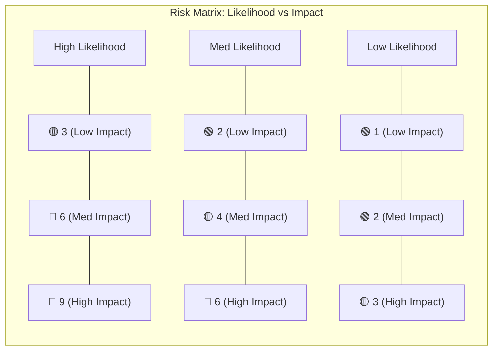
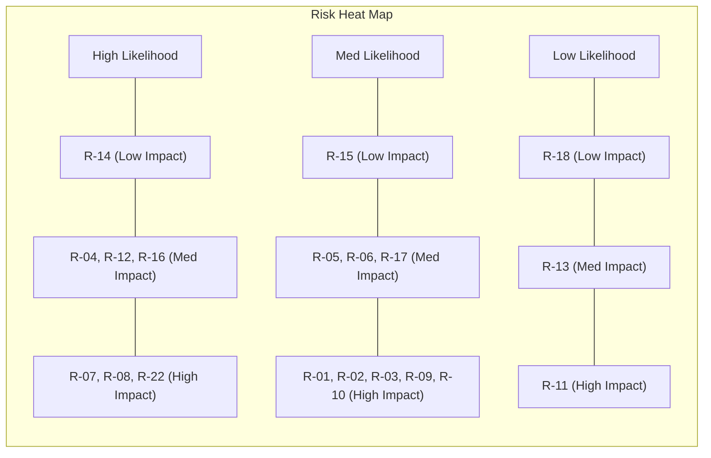

## Table of Contents

1. [Risk Assessment Framework](#1-risk-assessment-framework)
2. [Risk Heat Map](#2-risk-heat-map)
3. [Risk Register](#3-risk-register)
   - [Architecture & Design](#31-architecture--design-risks)
   - [Security](#32-security-risks)
   - [Blockchain & Deployment](#33-blockchain--deployment-risks)
   - [Dependencies & Supply Chain](#34-dependencies--supply-chain-risks)
   - [Operational & UX](#35-operational--ux-risks)
   - [Testing & Quality](#36-testing--quality-risks)
4. [Risk Summary Dashboard](#4-risk-summary-dashboard)
5. [Review Cadence](#5-review-cadence)

---

## 1. Risk Assessment Framework

### 1.1 Definitions

This register uses a **3×3 qualitative risk assessment matrix** to evaluate and prioritise risks. Each risk is scored on two axes — **Likelihood** and **Impact** — producing a composite **Risk Level**.

#### Likelihood Scale

| Rating   | Score | Description                                                       |
| -------- | ----- | ----------------------------------------------------------------- |
| **Low**  | 1     | Unlikely to occur under normal operating conditions               |
| **Med**  | 2     | Possible under certain conditions or over extended timeframes     |
| **High** | 3     | Likely or almost certain to occur during normal project lifecycle |

#### Impact Scale

| Rating   | Score | Description                                                         |
| -------- | ----- | ------------------------------------------------------------------- |
| **Low**  | 1     | Minor inconvenience; workaround exists; no data loss                |
| **Med**  | 2     | Degraded functionality; partial feature loss; user workflow delayed |
| **High** | 3     | Critical failure; data/asset loss; security breach; full outage     |

#### Risk Level Calculation

Calculation: _Risk Score = Likelihood × Impact_

| Risk Level    | Score Range | Action Required                                                      |
| ------------- | ----------- | -------------------------------------------------------------------- |
| 🟢 **Low**    | 1 – 2       | Accept and monitor. Review during regular cadence.                   |
| 🟡 **Medium** | 3 – 4       | Mitigate proactively. Assign owner and track resolutions.            |
| 🔴 **High**   | 6 – 9       | Immediate action required. Escalate and block release if unresolved. |

### 1.2 Risk Matrix

---

## 2. Risk Heat Map

Visual summary of all identified risks plotted on the 3×3 matrix:

🟢 Low (1-2) 🟡 Medium (3-4) 🔴 High (6-9)

---

## 3. Risk Register

### 3.1 Architecture & Design Risks

---

#### R-01 — EVE Frontier Move API Stability

| Field           | Detail                                                                                                                                                                                                                         |
| --------------- | ------------------------------------------------------------------------------------------------------------------------------------------------------------------------------------------------------------------------------ |
| **Category**    | Architecture                                                                                                                                                                                                                   |
| **Description** | The Smart Turret API has been finalized (commit 78854fe). The actual implementation is now stable with documented public functions and accessor patterns. Future changes should be tracked via the world-contracts repository. |
| **Likelihood**  | Med (2)                                                                                                                                                                                                                        |
| **Impact**      | High (3)                                                                                                                                                                                                                       |
| **Risk Level**  | � **6 — High**                                                                                                                                                                                                                 |
| **Mitigation**  | Pluggable `CodeGenerator` interface per node type. Design for API surface change via strategy swap without modifying the core pipeline. Maintain snapshot tests on generated code to catch regressions on API updates.         |
| **Owner**       | Lead Developer                                                                                                                                                                                                                 |
| **Status**      | **Finalized** — Emitter updated to reflect `world::turret` implementation with `TargetCandidate`, `ReturnTargetPriorityList`, and correct function signatures.                                                                 |

---

#### R-22 — Extension Dispatch Is Caller-Routed, Not Contract-Dispatched

| Field           | Detail                                                                                                                                                                                                                                                                                                                                                                                                                                                                                                                                                                                                   |
| --------------- | -------------------------------------------------------------------------------------------------------------------------------------------------------------------------------------------------------------------------------------------------------------------------------------------------------------------------------------------------------------------------------------------------------------------------------------------------------------------------------------------------------------------------------------------------------------------------------------------------------- |
| **Category**    | Integration                                                                                                                                                                                                                                                                                                                                                                                                                                                                                                                                                                                              |
| **Description** | The `world::turret::get_target_priority_list()` function asserts `option::is_none(&turret.extension)` — it **aborts** if an extension is configured rather than dispatching to it. This is by design: the game server is responsible for routing calls to the correct extension module. However, this means FrontierFlow-generated extension contracts are never invoked by the world contract itself; the game server must know the extension's package ID and function signature to call it directly. This creates a tight coupling between the deployed extension and the game server's call routing. |
| **Likelihood**  | High (3)                                                                                                                                                                                                                                                                                                                                                                                                                                                                                                                                                                                                 |
| **Impact**      | High (3)                                                                                                                                                                                                                                                                                                                                                                                                                                                                                                                                                                                                 |
| **Risk Level**  | 🔴 **9 — High**                                                                                                                                                                                                                                                                                                                                                                                                                                                                                                                                                                                          |
| **Mitigation**  | FrontierFlow must generate extension contracts that strictly follow the correct function signature pattern: `get_target_priority_list(turret: &Turret, owner_character: &Character, target_candidate_list: vector<u8>, receipt: OnlineReceipt) → vector<u8>`. The function receives BCS-serialized `vector<TargetCandidate>` and returns BCS-serialized `vector<ReturnTargetPriorityList>`. The game server resolves the package ID from the `turret.extension` TypeName field and calls the extension's function directly. See [OUTSTANDING-QUESTIONS.md](./OUTSTANDING-QUESTIONS.md).                  |
| **Owner**       | Lead Developer                                                                                                                                                                                                                                                                                                                                                                                                                                                                                                                                                                                           |
| **Status**      | **Under Investigation** — Contract dispatch pattern analysed. Awaiting clarification on game server routing mechanism.                                                                                                                                                                                                                                                                                                                                                                                                                                                                                   |

---

#### R-02 — Code Generation Produces Invalid Move Code

| Field           | Detail                                                                                                                                                                                                                |
| --------------- | --------------------------------------------------------------------------------------------------------------------------------------------------------------------------------------------------------------------- |
| **Category**    | Architecture                                                                                                                                                                                                          |
| **Description** | The `codeGenerator.ts` translates visual graphs into Sui Move source. Incorrect template logic, missing edge cases in graph topologies, or unsupported node combinations may produce malformed or non-compiling code. |
| **Likelihood**  | Med (2)                                                                                                                                                                                                               |
| **Impact**      | High (3)                                                                                                                                                                                                              |
| **Risk Level**  | 🔴 **6 — High**                                                                                                                                                                                                       |
| **Mitigation**  | Constraint Engine (Phase 3) validates graph completeness before emission. AST Pruning pass eliminates dead branches. Compiler error traceability maps failures back to specific nodes on the canvas.                  |
| **Owner**       | Lead Developer                                                                                                                                                                                                        |
| **Status**      | Open — Multi-phase pipeline designed, not yet implemented                                                                                                                                                             |

---

#### R-03 — AST Optimisation Alters Contract Semantics

| Field           | Detail                                                                                                                                                                                                                            |
| --------------- | --------------------------------------------------------------------------------------------------------------------------------------------------------------------------------------------------------------------------------- |
| **Category**    | Architecture                                                                                                                                                                                                                      |
| **Description** | The AST Pruning & Gas Optimisation pass (Phase 3.5) performs Dead Branch Elimination, Redundant Vector Folding, and Constant Propagation. Aggressive optimisation may inadvertently alter the semantic meaning of generated code. |
| **Likelihood**  | Med (2)                                                                                                                                                                                                                           |
| **Impact**      | High (3)                                                                                                                                                                                                                          |
| **Risk Level**  | 🔴 **6 — High**                                                                                                                                                                                                                   |
| **Mitigation**  | Each optimisation pass emits an `OptimisationReport` with `nodesRemoved` / `nodesRewritten` counts. Snapshot testing of optimised vs. unoptimised outputs. Optional disable flag per optimisation for debugging.                  |
| **Owner**       | Lead Developer                                                                                                                                                                                                                    |
| **Status**      | Open                                                                                                                                                                                                                              |

---

### 3.2 Security Risks

---

#### R-04 — Move Code Injection via Node Labels

| Field           | Detail                                                                                                                                                                                                                    |
| --------------- | ------------------------------------------------------------------------------------------------------------------------------------------------------------------------------------------------------------------------- |
| **Category**    | Security                                                                                                                                                                                                                  |
| **Description** | User-supplied node labels are interpolated into generated Move source code. A malicious label containing Move syntax (e.g., `"); abort 0; //`) could inject arbitrary logic into the generated smart contract.            |
| **Likelihood**  | High (3)                                                                                                                                                                                                                  |
| **Impact**      | Med (2)                                                                                                                                                                                                                   |
| **Risk Level**  | 🔴 **6 — High**                                                                                                                                                                                                           |
| **Mitigation**  | Sanitise all user inputs before code generation. CONSTITUTION mandates "no dynamic code execution from user input." Enforce strict alphanumeric + underscore input validation on any value that enters the Emitter phase. |
| **Owner**       | Lead Developer                                                                                                                                                                                                            |
| **Status**      | Open — Policy exists, implementation validation needed                                                                                                                                                                    |

---

#### R-05 — XSS Through Custom Node Content

| Field           | Detail                                                                                                                                                                           |
| --------------- | -------------------------------------------------------------------------------------------------------------------------------------------------------------------------------- |
| **Category**    | Security                                                                                                                                                                         |
| **Description** | User-provided labels or data fields rendered in React components could introduce XSS if any rendering path bypasses React's built-in escaping (e.g., `dangerouslySetInnerHTML`). |
| **Likelihood**  | Med (2)                                                                                                                                                                          |
| **Impact**      | Med (2)                                                                                                                                                                          |
| **Risk Level**  | 🟡 **4 — Medium**                                                                                                                                                                |
| **Mitigation**  | React's default JSX escaping handles most cases. Audit all components to confirm no `dangerouslySetInnerHTML` usage. Sanitise labels on input, not just on render.               |
| **Owner**       | Lead Developer                                                                                                                                                                   |
| **Status**      | Open                                                                                                                                                                             |

---

#### R-06 — GitHub OAuth Token Exposure

| Field           | Detail                                                                                                                                                                                       |
| --------------- | -------------------------------------------------------------------------------------------------------------------------------------------------------------------------------------------- |
| **Category**    | Security                                                                                                                                                                                     |
| **Description** | The GitHub OAuth flow exchanges codes for access tokens via a Netlify serverless function. Misconfigured CORS, insecure token storage, or client-side logging could expose the access token. |
| **Likelihood**  | Med (2)                                                                                                                                                                                      |
| **Impact**      | Med (2)                                                                                                                                                                                      |
| **Risk Level**  | 🟡 **4 — Medium**                                                                                                                                                                            |
| **Mitigation**  | Store tokens in memory only (never localStorage). Apply strict CORS on the Netlify function. CONSTITUTION mandates zero tolerance for logged secrets. Regular audit of token handling.       |
| **Owner**       | Lead Developer                                                                                                                                                                               |
| **Status**      | Open                                                                                                                                                                                         |

---

### 3.3 Blockchain & Deployment Risks

---

#### R-07 — WASM Compiler Failure in Browser

| Field           | Detail                                                                                                                                                                                                                       |
| --------------- | ---------------------------------------------------------------------------------------------------------------------------------------------------------------------------------------------------------------------------- |
| **Category**    | Blockchain / Deployment                                                                                                                                                                                                      |
| **Description** | The `@zktx.io/sui-move-builder` WASM compiler runs entirely in-browser. Browser memory limits, Web Worker incompatibilities, or WASM loading failures could prevent compilation on user devices.                             |
| **Likelihood**  | High (3)                                                                                                                                                                                                                     |
| **Impact**      | High (3)                                                                                                                                                                                                                     |
| **Risk Level**  | 🔴 **9 — High**                                                                                                                                                                                                              |
| **Mitigation**  | Lazy-load WASM bundle to minimise initial load. Display actionable error messages via toast notifications on failure. Consider a server-side fallback compiler endpoint. Test across major browsers (Chrome, Firefox, Edge). |
| **Owner**       | Lead Developer                                                                                                                                                                                                               |
| **Status**      | Open — Toast notification system designed, not yet implemented                                                                                                                                                               |

---

#### R-08 — UpgradeCap Loss Causes Bricked Contract

| Field           | Detail                                                                                                                                                                                                                                                      |
| --------------- | ----------------------------------------------------------------------------------------------------------------------------------------------------------------------------------------------------------------------------------------------------------- |
| **Category**    | Blockchain / Deployment                                                                                                                                                                                                                                     |
| **Description** | The `UpgradeCap` object ID is persisted in IndexedDB (browser-local). If the user clears browser data, switches browsers, or the IndexedDB entry is corrupted, the `UpgradeCap` reference is lost permanently. The deployed package becomes non-upgradable. |
| **Likelihood**  | High (3)                                                                                                                                                                                                                                                    |
| **Impact**      | High (3)                                                                                                                                                                                                                                                    |
| **Risk Level**  | 🔴 **9 — High**                                                                                                                                                                                                                                             |
| **Mitigation**  | Back up `UpgradeCap` references to the user's GitHub repository alongside graph state. Provide a UI flow to manually re-link an `UpgradeCap` by object ID. Display prominent warnings about browser data persistence.                                       |
| **Owner**       | Lead Developer                                                                                                                                                                                                                                              |
| **Status**      | Open — GitHub persistence designed but UpgradeCap backup not yet explicit                                                                                                                                                                                   |

---

#### R-09 — Deployed Contract Has Unintended On-Chain Behaviour

| Field           | Detail                                                                                                                                                                                                     |
| --------------- | ---------------------------------------------------------------------------------------------------------------------------------------------------------------------------------------------------------- |
| **Category**    | Blockchain / Deployment                                                                                                                                                                                    |
| **Description** | A low-code user may deploy a contract that behaves differently than the visual graph suggests — incorrect priority queue ordering, wrong friend-or-foe logic — resulting in real financial or game impact. |
| **Likelihood**  | Med (2)                                                                                                                                                                                                    |
| **Impact**      | High (3)                                                                                                                                                                                                   |
| **Risk Level**  | 🔴 **6 — High**                                                                                                                                                                                            |
| **Mitigation**  | Integrated Testing Engine (TS evaluation + Move `#[test]` generation) validates graph behaviour before deployment. Code preview modal shows exact generated output. Upgrade flow enables rapid fixes.      |
| **Owner**       | Lead Developer                                                                                                                                                                                             |
| **Status**      | Open — Testing engine designed                                                                                                                                                                             |

---

#### R-10 — Package Upgrade Breaks Compatibility

| Field           | Detail                                                                                                                                                                                                                                            |
| --------------- | ------------------------------------------------------------------------------------------------------------------------------------------------------------------------------------------------------------------------------------------------- |
| **Category**    | Blockchain / Deployment                                                                                                                                                                                                                           |
| **Description** | When an existing package is upgraded via `txb.upgrade()`, incompatible struct layout changes or removed public functions will cause the Sui VM to reject the upgrade transaction, or worse, break downstream consumers without clear diagnostics. |
| **Likelihood**  | Med (2)                                                                                                                                                                                                                                           |
| **Impact**      | High (3)                                                                                                                                                                                                                                          |
| **Risk Level**  | 🔴 **6 — High**                                                                                                                                                                                                                                   |
| **Mitigation**  | Default to `UpgradePolicy::Compatible` which enforces struct + function signature stability. Show warning modal before policy override. Pre-flight diff of old vs. new module signatures before submission.                                       |
| **Owner**       | Lead Developer                                                                                                                                                                                                                                    |
| **Status**      | Open — Compatible policy default designed, not yet implemented                                                                                                                                                                                    |

---

### 3.4 Dependencies & Supply Chain Risks

---

#### R-11 — Third-Party WASM Compiler Supply Chain Attack

| Field           | Detail                                                                                                                                                                                                            |
| --------------- | ----------------------------------------------------------------------------------------------------------------------------------------------------------------------------------------------------------------- |
| **Category**    | Supply Chain                                                                                                                                                                                                      |
| **Description** | `@zktx.io/sui-move-builder` is a third-party WASM binary executed in the user's browser. A compromised package version could inject malicious bytecode into the compiled module, stealing assets upon deployment. |
| **Likelihood**  | Low (1)                                                                                                                                                                                                           |
| **Impact**      | High (3)                                                                                                                                                                                                          |
| **Risk Level**  | 🟡 **3 — Medium**                                                                                                                                                                                                 |
| **Mitigation**  | Pin exact dependency versions. Enable dependency auditing (`bunx npm-audit`) in CI. Verify package integrity hashes. Evaluate self-hosting the WASM binary with known-good checksum verification.                 |
| **Owner**       | Lead Developer                                                                                                                                                                                                    |
| **Status**      | Open                                                                                                                                                                                                              |

---

#### R-12 — GitHub API Rate Limiting Disrupts Compilation

| Field           | Detail                                                                                                                                                                                             |
| --------------- | -------------------------------------------------------------------------------------------------------------------------------------------------------------------------------------------------- |
| **Category**    | Dependencies                                                                                                                                                                                       |
| **Description** | WASM compilation fetches Sui Framework dependencies from GitHub. Without authentication the rate limit is 60 req/hr — easily exceeded during iterative development, blocking compilation entirely. |
| **Likelihood**  | High (3)                                                                                                                                                                                           |
| **Impact**      | Med (2)                                                                                                                                                                                            |
| **Risk Level**  | 🔴 **6 — High**                                                                                                                                                                                    |
| **Mitigation**  | GitHub OAuth raises limit to 5,000 req/hr. `idb-keyval` caches dependencies with TTL in IndexedDB. Prompt unauthenticated users to log in when approaching limits.                                 |
| **Owner**       | Lead Developer                                                                                                                                                                                     |
| **Status**      | Open — Caching and OAuth designed                                                                                                                                                                  |

---

#### R-13 — React Flow (xyflow) Breaking Changes

| Field           | Detail                                                                                                                                                                                         |
| --------------- | ---------------------------------------------------------------------------------------------------------------------------------------------------------------------------------------------- |
| **Category**    | Dependencies                                                                                                                                                                                   |
| **Description** | `@xyflow/react` v12 is a core dependency for the entire node canvas. Major version bumps may alter APIs for custom nodes, handles, edge rendering, or state hooks — requiring broad refactors. |
| **Likelihood**  | Low (1)                                                                                                                                                                                        |
| **Impact**      | Med (2)                                                                                                                                                                                        |
| **Risk Level**  | 🟢 **2 — Low**                                                                                                                                                                                 |
| **Mitigation**  | Pin `@xyflow/react` to `^12.x`. Monitor changelogs. Abstract React Flow usage behind wrapper hooks/components to localise migration surface.                                                   |
| **Owner**       | Lead Developer                                                                                                                                                                                 |
| **Status**      | Accepted                                                                                                                                                                                       |

---

### 3.5 Operational & UX Risks

---

#### R-14 — Browser Memory Exhaustion on Large Graphs

| Field           | Detail                                                                                                                                                                                         |
| --------------- | ---------------------------------------------------------------------------------------------------------------------------------------------------------------------------------------------- |
| **Category**    | Operational / UX                                                                                                                                                                               |
| **Description** | Very large node graphs (50+ nodes) combined with WASM compilation, react-syntax-highlighter, and dagre layout calculations may exceed browser memory limits, causing tab crashes.              |
| **Likelihood**  | High (3)                                                                                                                                                                                       |
| **Impact**      | Low (1)                                                                                                                                                                                        |
| **Risk Level**  | 🟡 **3 — Medium**                                                                                                                                                                              |
| **Mitigation**  | Enforce a maximum node count with user warning. Lazy-load heavy dependencies (WASM, syntax highlighter). Debounce high-frequency events as per CONSTITUTION. Move compilation to a Web Worker. |
| **Owner**       | Lead Developer                                                                                                                                                                                 |
| **Status**      | Open — Lazy loading and debounce patterns mandated                                                                                                                                             |

---

#### R-15 — Graph State Loss on Page Refresh

| Field           | Detail                                                                                                                                                                                                        |
| --------------- | ------------------------------------------------------------------------------------------------------------------------------------------------------------------------------------------------------------- |
| **Category**    | Operational / UX                                                                                                                                                                                              |
| **Description** | Node and edge state is managed in React component state (`useNodesState`, `useEdgesState`). A page refresh, accidental navigation, or browser crash loses all unsaved work with no local auto-save mechanism. |
| **Likelihood**  | Med (2)                                                                                                                                                                                                       |
| **Impact**      | Low (1)                                                                                                                                                                                                       |
| **Risk Level**  | 🟢 **2 — Low**                                                                                                                                                                                                |
| **Mitigation**  | Implement auto-save to IndexedDB on every graph mutation (debounced). Add `beforeunload` browser prompt for unsaved changes. GitHub repo persistence provides cloud backup.                                   |
| **Owner**       | Lead Developer                                                                                                                                                                                                |
| **Status**      | Open — GitHub persistence designed, local auto-save not yet implemented                                                                                                                                       |

---

#### R-16 — Compiler Error Messages Incomprehensible to Low-Code Users

| Field           | Detail                                                                                                                                                                                                                  |
| --------------- | ----------------------------------------------------------------------------------------------------------------------------------------------------------------------------------------------------------------------- |
| **Category**    | UX                                                                                                                                                                                                                      |
| **Description** | When the WASM Move compiler produces errors, the raw output references Move source line numbers and internal types. Non-technical users cannot interpret these diagnostics, causing frustration and abandonment.        |
| **Likelihood**  | High (3)                                                                                                                                                                                                                |
| **Impact**      | Med (2)                                                                                                                                                                                                                 |
| **Risk Level**  | 🔴 **6 — High**                                                                                                                                                                                                         |
| **Mitigation**  | Compiler Error → Node Mapping pipeline: Emitter annotates lines with `@ff-node:` comments; parser resolves errors to originating canvas nodes with `.node-error-highlight` CSS highlighting and user-friendly messages. |
| **Owner**       | Lead Developer                                                                                                                                                                                                          |
| **Status**      | Open — Architecture designed in SOLUTION-DESIGN.md                                                                                                                                                                      |

---

#### R-17 — Socket Type Misconfiguration Produces Silent Logic Errors

| Field           | Detail                                                                                                                                                                                                              |
| --------------- | ------------------------------------------------------------------------------------------------------------------------------------------------------------------------------------------------------------------- |
| **Category**    | UX / Architecture                                                                                                                                                                                                   |
| **Description** | The typed socket system enforces connection rules via `socketCompatibility` matrix. If the matrix is incomplete, allows invalid connections, or blocks valid ones, users may wire incorrect graphs without warning. |
| **Likelihood**  | Med (2)                                                                                                                                                                                                             |
| **Impact**      | Med (2)                                                                                                                                                                                                             |
| **Risk Level**  | 🟡 **4 — Medium**                                                                                                                                                                                                   |
| **Mitigation**  | `useConnectionValidation` hook validates every connection attempt against the compatibility matrix. Unit test coverage for all 11 socket types × combinations. Visual colour-matching provides secondary feedback.  |
| **Owner**       | Lead Developer                                                                                                                                                                                                      |
| **Status**      | Open — Validation hook designed, not yet implemented                                                                                                                                                                |

---

### 3.6 Testing & Quality Risks

---

#### R-18 — Insufficient Test Coverage on Code Generator

| Field           | Detail                                                                                                                                                                                   |
| --------------- | ---------------------------------------------------------------------------------------------------------------------------------------------------------------------------------------- |
| **Category**    | Quality                                                                                                                                                                                  |
| **Description** | The code generation pipeline (IR transform → optimisation → emission) has many branching paths. Without comprehensive snapshot and integration tests, regressions may ship undetected.   |
| **Likelihood**  | Low (1)                                                                                                                                                                                  |
| **Impact**      | Low (1)                                                                                                                                                                                  |
| **Risk Level**  | 🟢 **1 — Low**                                                                                                                                                                           |
| **Mitigation**  | CONSTITUTION mandates comprehensive unit tests. Vitest snapshot testing on emitter output. Run standard graph configurations through the full pipeline and compare against golden files. |
| **Owner**       | Lead Developer                                                                                                                                                                           |
| **Status**      | Open - Testing mandate exists                                                                                                                                                            |

---

## 4. Risk Summary Dashboard

### By Risk Level

| Level         | Count | Risk IDs                                                         |
| ------------- | ----- | ---------------------------------------------------------------- |
| 🔴 **High**   | 11    | R-01, R-02, R-03, R-04, R-07, R-08, R-09, R-10, R-12, R-16, R-22 |
| 🟡 **Medium** | 5     | R-05, R-06, R-11, R-14, R-17                                     |
| 🟢 **Low**    | 3     | R-13, R-15, R-18                                                 |

### By Category

| Category                    | Count | Highest Risk |
| --------------------------- | ----- | ------------ |
| Architecture & Design       | 3     | 🔴 High      |
| Security                    | 3     | 🔴 High      |
| Blockchain & Deployment     | 4     | 🔴 High      |
| Dependencies & Supply Chain | 3     | 🔴 High      |
| Operational & UX            | 4     | 🔴 High      |
| Integration                 | 1     | 🔴 High      |
| Testing & Quality           | 1     | 🟢 Low       |

### Top 5 Critical Risks (Immediate Attention)

| Rank | ID   | Risk                                    | Score |
| ---- | ---- | --------------------------------------- | ----- |
| 1    | R-22 | Extension Dispatch Is Caller-Routed     | 9     |
| 2    | R-07 | WASM Compiler Failure in Browser        | 9     |
| 3    | R-08 | UpgradeCap Loss Causes Bricked Contract | 9     |
| 4    | R-01 | EVE Frontier Move API Stability         | 6     |
| 5    | R-02 | Code Generation Produces Invalid Move   | 6     |

---

## 5. Review Cadence

| Activity                         | Frequency   | Responsible    |
| -------------------------------- | ----------- | -------------- |
| Full risk register review        | Bi-weekly   | Lead Developer |
| Critical risk (🔴) status check  | Weekly      | Lead Developer |
| Post-incident risk reassessment  | Ad hoc      | Lead Developer |
| New feature risk impact analysis | Per feature | Lead Developer |
| Dependency vulnerability scan    | Weekly (CI) | Automated      |

> [!IMPORTANT]
> This register is a living document. New risks must be added as features evolve. All `🔴 High` risks must have active mitigation plans before any production deployment.
